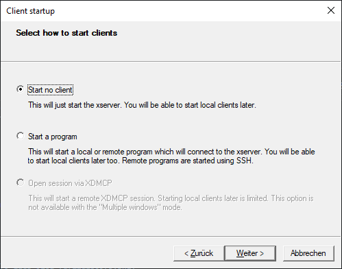

# Installation

## Requirements
Arena-rosnav is currently developed in and for Ubuntu 20.04.

### Git

```
sudo apt update && sudo apt install -y git
```

### ROS - Robot Operating System
###### 1. Configure your Ubuntu repositories

```
sudo add-apt-repository universe
sudo add-apt-repository multiverse
sudo add-apt-repository restricted
sudo apt update
```

###### 2. Set up your scources.list

```
sudo sh -c 'echo "deb http://packages.ros.org/ros/ubuntu $(lsb_release -sc) main" > /etc/apt/sources.list.d/ros-latest.list'
```

###### 3. Set up your keys

```
sudo apt-key adv --keyserver 'hkp://keyserver.ubuntu.com:80' --recv-key C1CF6E31E6BADE8868B172B4F42ED6FBAB17C654
```

###### 4. Installation

```
sudo apt update && sudo apt install -y ros-noetic-desktop-full
```

###### 5. Environment Setup

```
echo "source /opt/ros/noetic/setup.bash" >> ~/.bashrc # for bash
source ~/.bashrc
```

```
echo "source /opt/ros/noetic/setup.zsh" >> ~/.zshrc # for zsh
source ~/.zshrc
```

###### 6. Dependencies for building packages

```
sudo apt install -y python-rosdep python-rosinstall python-rosinstall-generator python-wstool build-essential
```

###### 7. Initialize rosdep

```
sudo rosdep init
rosdep update
```

###### 8. Install additional packages

```
sudo apt update && sudo apt install -y \
libopencv-dev \
liblua5.2-dev \
screen \
python3-rosdep \
python3-rosinstall \
python3-rosinstall-generator \
build-essential \
python3-rospkg-modules \
ros-noetic-navigation \
ros-noetic-teb-local-planner \
ros-noetic-mpc-local-planner \
libarmadillo-dev \
ros-noetic-nlopt \
ros-noetic-turtlebot3-description \
ros-noetic-turtlebot3-navigation \
ros-noetic-lms1xx \
ros-noetic-velodyne-description
```

### Python Poetry

```
curl -sSL https://raw.githubusercontent.com/python-poetry/poetry/master/get-poetry.py | python3 -
source $HOME/.poetry/env
```

## Recommendations (Optional)

### oh-my-zsh
We recommend using oh-my-zsh. You can set up oh-my-zsh with the following steps.
###### 1. Install zsh
```
sudo apt install zsh
```
###### 2. Install curl
```
sudo apt install curl
```
###### 3. Install oh-my-zsh
```
sh -c "$(curl -fsSL https://raw.githubusercontent.com/ohmyzsh/ohmyzsh/master/tools/install.sh)"
```
###### 4. Set up autosuggestions
```
git clone https://github.com/zsh-users/zsh-autosuggestions ${ZSH_CUSTOM:-~/.oh-my-zsh/custom}/plugins/zsh-autosuggestions
```
- Open your .zshrc with editor
```
nano ~/.zshrc
```
- Scroll down to ```plugins```
- Insert ```zsh-autosuggestions``` into ```plugins=()```.
Your plugins might look like this:
```
plugins=(git zsh-autosuggestions)
```
- Save with Ctrl+S
- Exit with Crtl+X
- Source your .zshrc
```
source $HOME/.zshrc
```
###### 5. Install Powerlevel10k Theme (optional)
```
git clone --depth=1 https://github.com/romkatv/powerlevel10k.git ${ZSH_CUSTOM:-$HOME/.oh-my-zsh/custom}/themes/powerlevel10k
```
- In your zshrc, search for ZSH_THEME, set ZSH_THEME="powerlevel10k/powerlevel10k", and follow install wizard.

### Visual Studio Code
We recommend using VSC as your programming environment. You can download VSC from the [official site](https://code.visualstudio.com/download).

## For Windows Users

### WSL2 (Windows-Subsystem for Linux)
Please follow the steps in this [WSL installation guide for Windows 10](https://docs.microsoft.com/en-us/windows/wsl/install-win10) to install WSL2 on your computer.

!!! note 

    You might encounter this problem during installation:

    ```
    Installing, this may take a few minutes...
    WslRegisterDistribution failed with error: 0x80370102
    Error: 0x80370102 The virtual machine could not be started because a required feature is not installed.
    ```

    This problem can be resolved by enabling CPU virtualization in your BIOS. How you can achieve this depends on your hardware.
    [This guide from bleepingcomputer](https://www.bleepingcomputer.com/tutorials/how-to-enable-cpu-virtualization-in-your-computer-bios/) might help you with that.

### Windows-X-Server
To use WSL with graphical programs, an X-server will need to be installed on the Windows 10 system and the DISPLAY variable will need to be set in Bash/Zsh.
One possible program to use is [VcXsrv](https://sourceforge.net/projects/vcxsrv/).

###### 1. Set up DISPLAY variable
- After installing the X-server you need to set the DISPLAY variable in your bash/zsh.
- Use ```nano ~/.bashrc``` or ```nano ~/.zshrc``` and insert the following code on the bottom of the file.

```export DISPLAY=$(cat /etc/resolv.conf | grep nameserver | awk '{print $2}'):0```

- Save with Ctrl+S and exit via Ctrl+X.

###### 2. Xlaunch Settings
- Start Xlaunch and configure it the following way. In the end the configuration can be saved.
###### 3. Display Settings
- Choose Option: Multiple Windows
- Set Display Number to 0


###### 4. Client Settings
- Choose Option: Start no Client



###### 5. Extra Settings
- Choose Option: Disable access control


!!! note
    If you encounter problems, you might go to Windows Defender Firewall -> Communication between Applications and Windows Firewall.
    Look for VcXsrv and change the settings to both private and public checked.

    Another problem might occur because of inbound rules from Windows Defender Firewall. Go to Windows Defender Firewall -> Advanced Settings -> Inbound -> Delete every rule for VcXsrv.

### Visual Studio Code plus WSL Extension
We recommend you use Visual Studio Code as your programming environment. Please follow the instructions in this [VS Code with WSL tutorial](https://docs.microsoft.com/en-us/windows/wsl/tutorials/wsl-vscode).

## Installation

!!! note
    Make sure your machine fulfills all the mandatory requirements listed above.

###### 1. Create catkin workspace
```
mkdir -p catkin_ws/src # name of the workspace can be arbitrary
cd catkin_ws/src
```

###### 2. Clone arena-rosnav repository
```
git clone https://github.com/Arena-Rosnav/arena-rosnav
cd arena-rosnav
```

###### 3. Update the ROS workspace
```
rosws update
```

###### 4. Install python packages with poetry
```
poetry shell && poetry install
```

###### 5. Install stable-baselines3
```
cd ../forks/stable-baselines3 && pip install -e .
```

###### 6. Build your workspace
```
cd ../../.. && catkin_make
```

!!! note
    If packages are missing during the build process, simply add them with
    ``` poetry add <package_name>```.

Finished! Check out the [Quickstart Guides](get_started.md) to start using arena-rosnav.