# Welcome to the Arena Rosnav docs!

[Arena Rosnav](https://github.com/Arena-Rosnav/arena-rosnav) is a set of tools for training and evaluating of navigational algorithms for obstacle avoidance. Arena Rosnav is modular and flexible and allows to easily integrate new environments and planners, as well as running existing planners and models in predefined benchmark scenarios and evaluating the performance with ease. Next to the planners and environments we offer a wide variety of different robots and worlds for your use.

Arena Rosnav offers a complete evaluation pipeline for benchmarking the performance of robots and planners based on standard metrics, and a trainings pipeline for navigational models based on DRL and PPO. With this pipeline our own DRL planner [ROSNavRL](packages/rosnavrl.md) was created.

## Features

<!-- - Integration of [Flatland](https://flatland-simulator.readthedocs.io/en/latest/) to train new agents and [Flatland](https://flatland-simulator.readthedocs.io/en/latest/) and [Gazebo](https://classic.gazebosim.org/) for evaluating existing approaches. -->
- Variety of planners, robots and worlds
- Pipeline to train planner agents based on reinforcement learning approaches from [stable baselines3](https://github.com/DLR-RM/stable-baselines3.git)
- [Task generator](packages/task_generator.md) for managing highly dynamic and custom environments
- Our own DRL planner [ROSNavRL](packages/rosnavrl.md)
- Pipeline for evaluating approaches and analysing them based on standard metrics with our [Evaluation](packages/arena_evaluation.md) package.
- Modular structure for extension of new functionalities and approaches
- Evaluation of multiple robots and planners in the same simulation
- Dynamic rviz config file creation for visualization
- 3 Simulators including Unity, Gazebo and Flatland 

<!-- |        Warehouse environment in Gazebo        |
| :-------------------------------------------: |
| 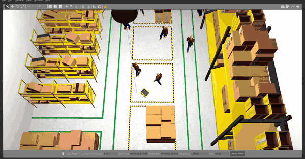 |

|       Hospital environment in Gazebo        |
| :-----------------------------------------: |
| 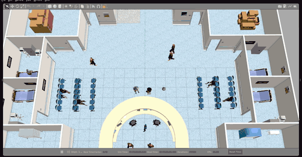 |

|             Simulation in Flatland              |
| :---------------------------------------------: |
| 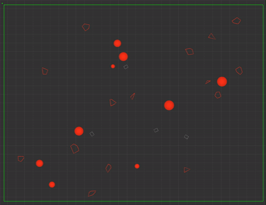 |

|      Multiple agents in one simulation       |
| :------------------------------------------: |
| 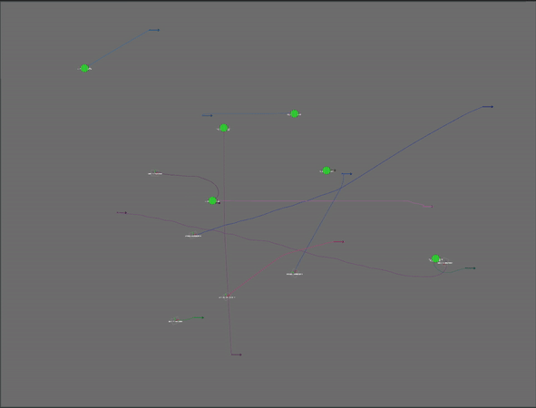 | -->

## Simulators

<h4 style="text-align: center;">Gazebo</h4>

| 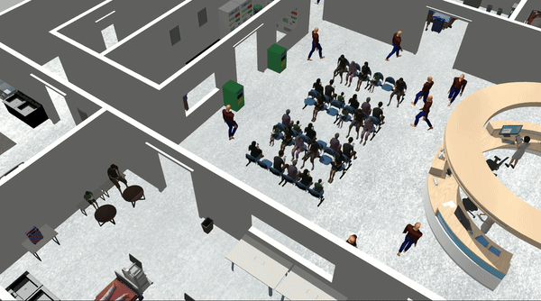 | 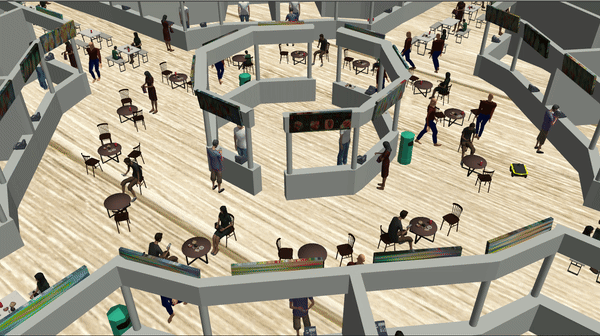 | 
| :--------------------------------------------------------------: | :---------------------------------------------------------------------: | 

| 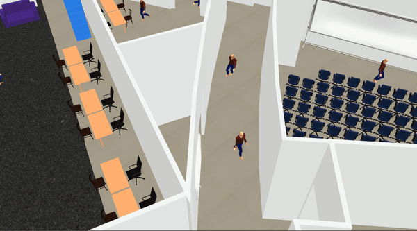 |  | 
| :--------------------------------------------------------------: | :---------------------------------------------------------------------: |

<h4 style="text-align: center;">Unity</h4>

|  |  | 
| :--------------------------------------------------------------: | :---------------------------------------------------------------------: | 

|  |  | 
| :--------------------------------------------------------------: | :---------------------------------------------------------------------: |

<h4 style="text-align: center;">Flatland</h4>

|  | 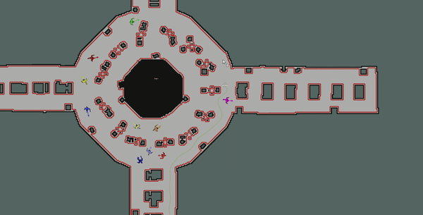 | 
| :--------------------------------------------------------------: | :---------------------------------------------------------------------: | 

| 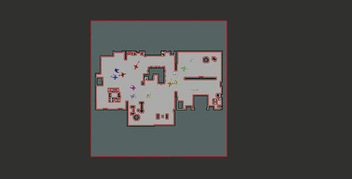 | 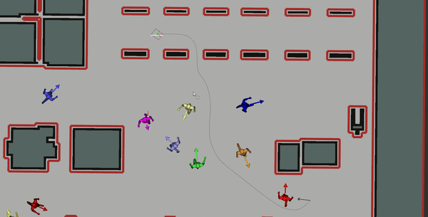 | 
| :--------------------------------------------------------------: | :---------------------------------------------------------------------: |

<!-- 
###### Gazebo

| 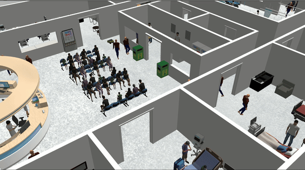 |  |  | 
| :--------------------------------------------------------------: | :---------------------------------------------------------------------: | :--------------------------------------------------------------------: | 

| 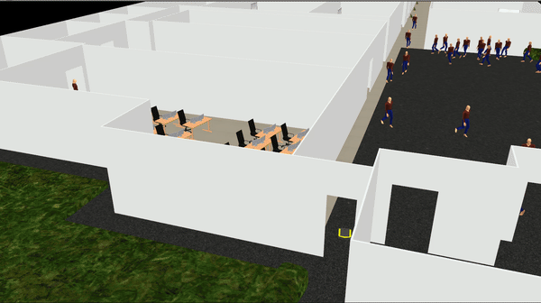 | 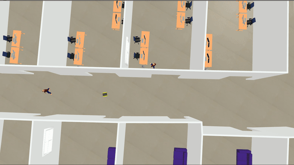 |  | 
| :--------------------------------------------------------------: | :---------------------------------------------------------------------: | :--------------------------------------------------------------------: |  

###### Unity

|  |  |  | 
| :--------------------------------------------------------------: | :---------------------------------------------------------------------: | :--------------------------------------------------------------------: | 

##### Flatland

|  |  |  | 
| :--------------------------------------------------------------: | :---------------------------------------------------------------------: | :--------------------------------------------------------------------: |  -->

### Planners

Planners are essential packages and control the robot, which is simulated in the environments.

We offer the following planners:

- ROSNavRL: Our own planner based on neural networks.
- Dragon: from the [BARN challenge](https://www.cs.utexas.edu/~xiao/BARN_Challenge/BARN_Challenge.html)
- Trail: from the [BARN challenge](https://www.cs.utexas.edu/~xiao/BARN_Challenge/BARN_Challenge.html)
- Applr: a hybrid approach by [Xuesu et al.](https://arxiv.org/abs/2105.07620)
- RLCA-ROS: a DRL-based colision avoidance approach from [Long et al.](https://github.com/Acmece/rl-collision-avoidance)
- CADRL: a DRL-based colision avoidance approach from [Everett et al.](https://github.com/mit-acl/cadrl_ros)
- SARL-Star
- Crowdnav-ROS: a DRL-based colision avoidance approach from [Chen et al.](https://github.com/vita-epfl/CrowdNav)
- TEB: a classic approach by [Rösmann et al.](https://github.com/rst-tu-dortmund/teb_local_planner)
- DWA: the standard ROS local planning approach by [Marder-Eppstein et al.](http://wiki.ros.org/dwa_local_planner)
- MPC: a classic approach by [Rösmann et al.](https://github.com/rst-tu-dortmund/teb_local_planner)

### Robots

We support different robots:

|                     _turtlebot3-burger_                     |                     _jackal_                     |                     _ridgeback_                      |                     _agv-ota_                     |                     _tiago_                     |
| :---------------------------------------------------------: | :----------------------------------------------: | :--------------------------------------------------: | :-----------------------------------------------: | :---------------------------------------------: |
| 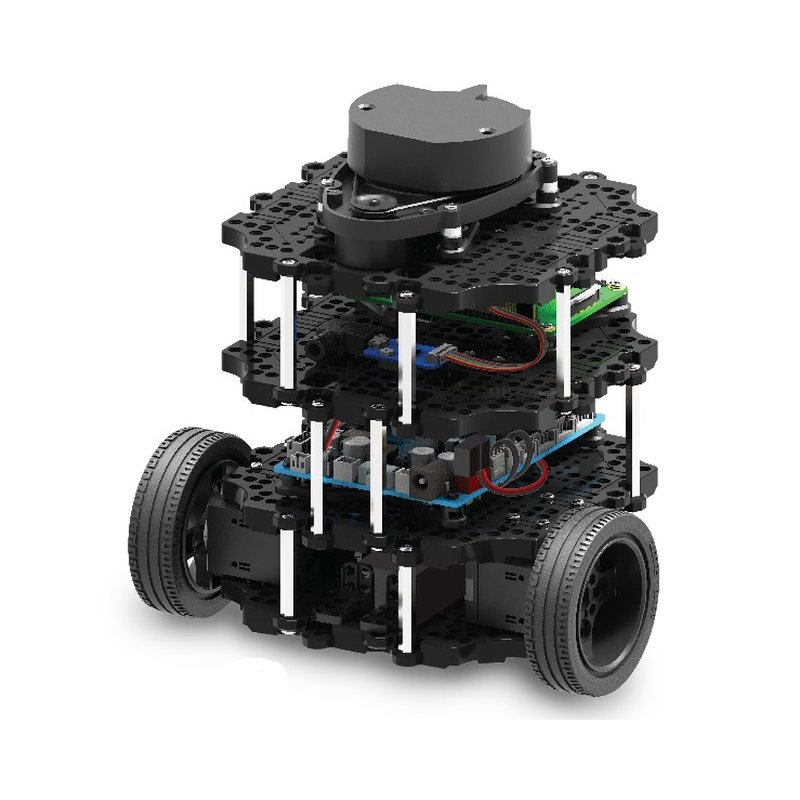 | 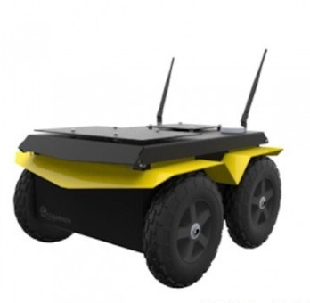 | 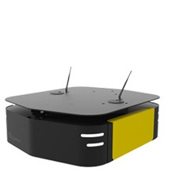 |  | 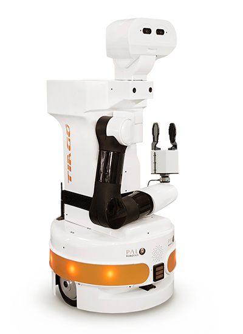 |

|                _Robotino(rto)_                |                     _youbot_                     |                     _turtlebot3_waffle_pi_                      |              _Car-O-Bot4 (cob4)_               |                     _dingo_                     |
| :-------------------------------------------: | :----------------------------------------------: | :-------------------------------------------------------------: | :--------------------------------------------: | :---------------------------------------------: |
|  | 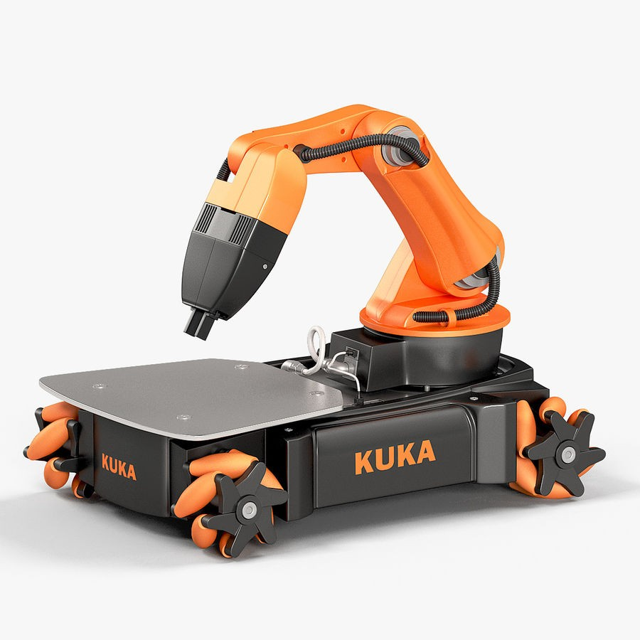 | 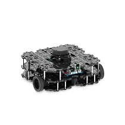 | 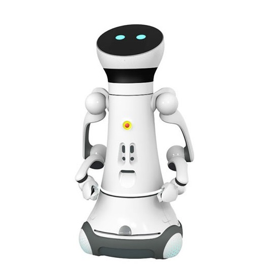 |  |

All robots are equipped with a laser scanner. The robots differ in size, laser-range etc. See below table for more detailed information on each robot:

| Name                            | Max Speed (v*x) [\_m/s*] | Max Speed (v*y) [\_m/s*] | Max Rotational Speed (θ*y) [\_rad/s*] | Radius [_m_] | Laser-range [_m_] |
| :------------------------------ | :----------------------: | :----------------------: | :-----------------------------------: | :----------: | :---------------: |
| _turtlebot3-burger (burger)_    |           0.22           |           0.0            |                 2.84                  |    0.113     |        3.5        |
| _jackal_                        |           2.0            |           0.0            |                  4.0                  |    0.267     |       30.0        |
| _ridgeback_                     |           1.1            |           0.5            |                  2.0                  |    0.625     |       10.0        |
| _agv-ota (agvota)_              |           0.5            |           0.0            |                  0.4                  |    0.629     |        5.0        |
| _rto_                           |           2.78           |           2.78           |                  1.0                  |    0.225     |        5.6        |
| _youbot_                        |           0.8            |           0.8            |                  1.2                  |    0.347     |        5.6        |
| _turtlebot3_waffle_pi (waffle)_ |           0.26           |           0.0            |                 1.82                  |    0.208     |        3.5        |
| _Car-O-Bot4 (cob4)_             |           1.1            |           0.2            |                  0.8                  |     0.36     |       29.5        |
| _dingo_                         |           1.3            |           0.0            |                 (4.0)                 |    0.378     |       30.0        |
| _tiago_                         |           1.5            |           0.0            |                  2.0                  |     0.27     |       25.0        |

### Environments

For training:

- [Flatland](https://flatland-simulator.readthedocs.io/en/latest/index.html)

For evaluation:

- [Flatland](https://flatland-simulator.readthedocs.io/en/latest/index.html)
- [Gazebo](https://classic.gazebosim.org/)

### Evaluation

To benchmark the performance of your simulation and visualize your results with qualitative and quantitative plots like in the example below, see the documentation [here](packages/arena_evaluation.md)

|  |  |
| :------------------------------------------------------------: | :-------------------------------------------------------------: |
|                  _Exemplary qualitative plot_                  |                  _Exemplary quantitative plot_                  |

