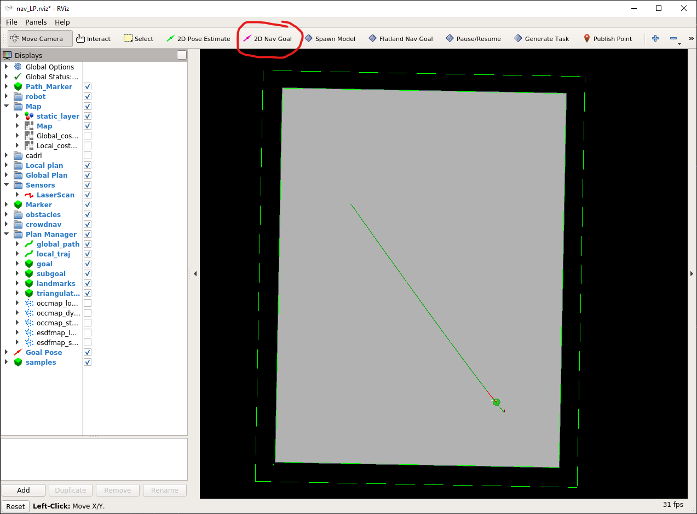

# General Utils

General utils packages are used in the simulation environments. Each cover a specific task.

## Task Generator
Creates and sets up the scenarios for the robot to solve. This includes spawning of the robot model as well as the obstacles and their behavior. Incorporates the robot manager, obstacle manager, and different types of tasks. The scenario configuration files are stored in this repository.
The task generator package designed to work with:

- arena-rosnav
- arena-rosnav-3d

The task generator is especially designed for single robot simulations.

### Task Modes

Our task generator package offers four task modes. We define a task as the process of a robot driving to a desired goal. A new task is started when the robot reaches the goal or after 3 min have passed. For the scenario task, the task is only resetted for the in the scenario file defined amount.

###### Random Task

Creates random static and dynamic obstacles when a new task is started. When starting the task a random goal and start position is selected. After the robot reaching the goal a new task is started.

###### Manual Task

Manual task mode is the same as the random task beside that a goal can be set manually via the rviz 2D goal button.



###### Staged Task

The staged task mode is designed for the trainings process of arena-rosnav. In general, it behaves like the random task mode but there are multiple stages one can switch between. Between the stages, the amount of static and dynamic obstacles changes. The amount of obstacles is defined in a curriculum file, the path to said file is a key in the `paths` parameter.

The **curriculum** file has the following schema.

```yaml
1:
  static: <amount of static obstacles for stage 1>
  dynamic: <amount of dynamic obstacles for stage 1>
2:
  static: <amount of static obstacles for stage 2>
  dynamic: <amount of dynamic obstacles for stage 2>
\.\.\.
N:
  static: <amount of static obstacles for stage N>
  dynamic: <amount of dynamic obstacles for stage N>
```

###### Scenario Task
The scenario task mode loads a predefined task from a scenario.json file in which the positions of start, goal and the properties of the obstacles are specified. This task will be repeated for a set amount of times until the simulation terminates automatically.

## Arena Tools
A collection of arena specific tools for generating components like maps, robot footprints, obstacles and scenario files that can be used by the task generator.

## Arena Simulation Setup
Stores configuration files for robots, maps and obstacles which are used during simulation. The task generator uses the robot and obstacle definitions from this repository.

## Arena Utils
A collection of additional packages, e.g sensor measurements, mapping and visualization.

## Waypoint Generator
If deployed, generates subgoals along the global path. This package is used by some planners, e.g. Rosnav.