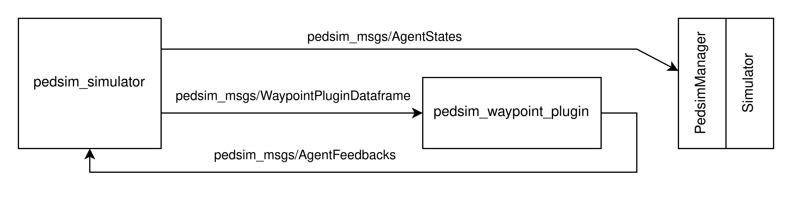
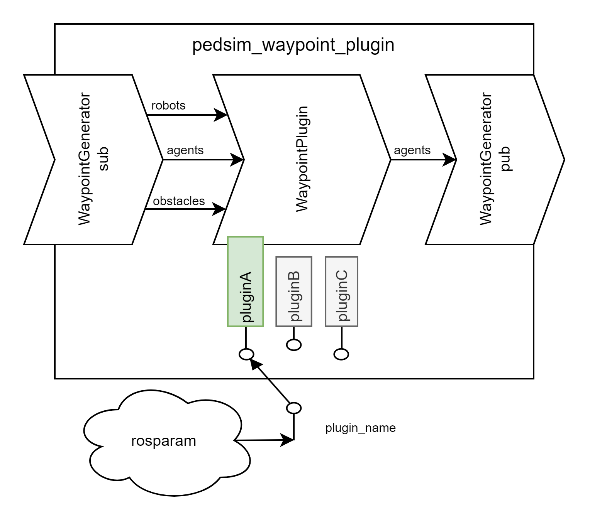

# pedsim_waypoint_plugin

## Overview

The `pedsim_waypoint_plugin` provides an interface for overriding the default behavior of agents (also: pedestrians, peds, dynamic obstacles) with any other abstract behavior.

### Architecture

Overriding pedsim calculations is achieved by remapping the output of the `pedsim_simulator/simulated_agents` service to an additional `pedsim_waypoint_plugin`node (plugin node), which can overwrite the calculations before it sends them to the intended recipients (`PedsimManager` and `pedsim_simulator` feedback loop).



### Data Flow

In order to allow sophisticated calculations (equal-or-better philosophy against pedsim), the basic `simulated_agents` data is complemented by additional pre-calculation data and packaged into a `WaypointPluginDataframe` message (defined at `pedsim_ros/pedsim_msgs/msg/WaypointPluginDataframe.msg`).

The pre- and post-processing of the full messages coming in and out of the plugin node is handled automatically, and the raw data is handled inside a pre-selected `WaypointPlugin`.



This results in an event-driven, fire-and-forget architecture, with its abstract nature allowing provisions for different possible approaches to computational scalability challenges:
- stateful computations
- output interpolation

### Usage
#### Internals

Data arriving at the `WaypointPlugin` is split into an `InputData` object with the following properties.

|field|type|properties (selection)|description|
|---|---|---|---|
|`header`|`std_msgs/Header`|`.stamp.secs`<br/>`.stamp.nsecs`|simulation time|
|`robots`|`List[pedsim_msgs/RobotState]`|`.pose.position`<br/>`.pose.orientation`|robot name, pose|
|`groups`|`List[pedsim_msgs/AgentGroup]`|-|currently unpopulated|
|`waypoints`|`List[pedsim_msgs/Waypoint]`|`.position`|static obstacles|
|`agents`|`List[pedsim_msgs/AgentState]`|`.pose`<br/>`.twist`<br/>`.forces`<br/>`.destination`|extended agent state|

The aim of the WaypointPlugin is to transform this data into a single `OutputData` object of type `List[pedsim_msgs/AgentState]` which is then published to the simulator and into the pedsim feedback loop.

### Writing a WaypointPlugin

1. Initialize your project structure inside the `arena-rosnav` repository by opening `arena-rosnav/utils/ros/rosnodes/pedsim_waypoint_plugin/pedsim_waypoint_plugin` as a workspace.

2. Create a subdirectory `<your_plugin_name>` in `plugins`.

3. Create a file `<your_plugin_name>/main.py`.

4. Add the line `from .plugins.<your_plugin_name> import main # noqa` to `__init__.py`.

5. Add a unique identifier to the `WaypointPluginName` type in `pedsim_waypoint_plugin.py`. (This identifier will be used in the launchfile argument).

6. Add the following skeleton to your `main.py`:

```python
from pedsim_waypoint_plugin.pedsim_waypoint_generator import OutputData, PedsimWaypointGenerator, InputData, WaypointPluginName, WaypointPlugin

@PedsimWaypointGenerator.register(WaypointPluginName.<YOUR_PLUGIN_NAME>)
class Plugin_Passthrough(WaypointPlugin):
    def __init__(self):
        pass;

    def callback(self, data) -> OutputData:
        return data.agents
```

You can now use your plugin by setting the roslaunch argument `pedsim_waypoint_plugin:=<your_plugin_name>`.

Apart from this basic structure, the content of your plugin's folder is free to modify. It is recommended to practice by implementing these rudimentary plugins with increasing difficulty:

1. Make each actor face backwards (moonwalk). [stateless, low-feedback],
2. Make each actor progressively spin in a circle [stateful, low-feedback],
3. Make each actor walk in a "figure 8" [stateful, high-feedback].