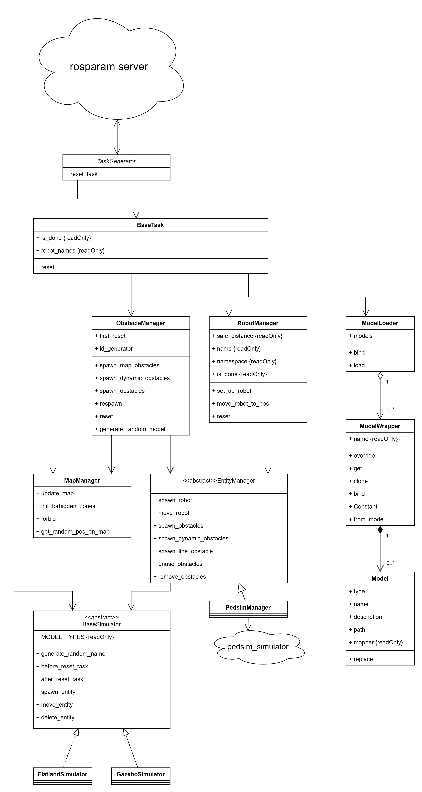

# Task Generator/ Task Manager

The Task Manager is a critical component of the Arena Rosnav infrastructure and is an abstraction layer across multiple different simulators (currently Flatland (2D), Gazebo (3D), and Unity (3D). The purpose is to be able to create worlds and scenarios independently from the simulator and it is designed in a way to make integration of new simulators as easy and modular as possible. When implementing and integrating new simulators, it is critical to follow the conventions of the task manager. Therefore, please refer to the technical system design is illustrated in Figure 1. Its primary functions include:

1. **Creating and Managing Obstacles:** This component is responsible for both dynamic and static obstacles within the simulation environment.

2. **Generating Starting Positions and Goals:** It generates new starting positions and goals for every robot participating in the simulation.

3. **Setting Up Robots:** It prepares all the robots for a simulation based on robot setup files.

4. **Reading and Configuring Setup Files:** The Task Generator can read and correctly set up existing configuration files for various simulation parameters.

## Task Modes

The Task Generator operates in three primary modes, each serving a distinct purpose:

**Staged Mode:**
   - The staged task mode is designed for the trainings process of arena-rosnav.
   - In general, it behaves like the random task mode but there are multiple stages between one can switch.
   - Between the stages, the amount of static and dynamic obstacles changes.
   - The amount of obstacles is defined in a curriculum file, the path to said file is a key in the paths parameter.

**Random Mode:**
   - In this mode, each simulation run features random starting positions and goals for the robots.
   - The mode also involves the random placement of static, interactive, and dynamic obstacles within the environment.
   - The number of obstacles is randomly determined for each run.

 **Scenario Mode:**
   - This mode utilizes a predefined scenario that is repeated for each run.
   - It requires a scenario file that specifies the initial positions of all robots, obstacles, waypoints, and goals.
   
**Random Scenario Mode:**
   - In this mode, obstacles are spawned at random locations.
   - Waypoints are also placed randomly.
   - However, the type and number of obstacles are predefined within an XML configuration file.

## Scenario File

The scenario file is a critical component for the "Scenario Mode" of the Task Generator. It contains information about the initial setup of a simulation run, including the positions of robots, obstacles, waypoints, and goals. This file provides a consistent environment for repeated simulations based on a predefined scenario.

## Robot Setup File

The robot setup file is essential for configuring the robots participating in the simulation. It contains details about each robot's characteristics, such as its model, sensors, capabilities, and initial settings. This file is used by the Task Generator to set up and configure the robots correctly for a simulation run.

## System Design
The following Figure, illustrates the low-level system design of the task manager with all classes and how they interconnect. 

