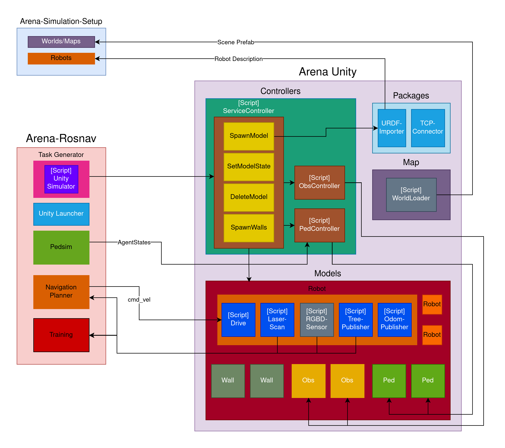

# Arena Unity

Arena Unity, also called Unity Simulator, is our own integration of the Unity Engine into Arena Rosnav. The Unity Simulator has the same core functionalities as Flatland and Gazebo. Among other things, we are able to load maps from Arena Rosnav into a Unity scene where we can spawn pedestrians, obstacles and most importantly the robot itself. This robot in Arena Unity is configured dynamically according to configuration files within Arena Rosnav.  
This integration was done to train with an RBG-D sensor within the photo-realistic simulation. Next to the photo-realism, it also holds other advantages for training over Gazebo. 

## Tutorials

Get started with these tutorials. If you want to develop Arena Unity, you need to do both tutorials.

- [**How to Use Arena Unity**](how_to_use_arena_unity.md)
- [**How to Develop Arena Unity**](how_to_develop_arena_unity.md)

## Training

Arena Unity has been integrated into the training pipeline. It can be used to train DRL agents in the Rosnav-RL repo, like the Flatland Simulator.

- [**How to Train with Arena Unity**](train_with_arena_unity.md)
- [**Arena Unity Training Integration (Technical Documentation)**](training_integration.md)

## Features

Click on the feature names to get more documentation where available.

- [**RGB-D Sensor**](rgbd_scan.md): The RGB-D sensor gathers RGB and depth data. It was especially complex to implement since Unity doesn't provide support for gathering depth data.
- [**Pedestrian Integration**](pedestrian_integration.md): The pedestrians managed and physically simulated by Pedsim are visualized by Arena Unity, plus supporting different states with their own animations.
- [**Dynamic Map Loading**](dynamic_map_loading.md): For every map of Arena Rosnav, there isn't a Unity Scene being loaded but rather the map layout through walls within Unity.
- [**Laser Scan and Dynamic Configuration**](dynamic_configuration.md): The laser scan for each robot is supported and all the parameters (angles, scan rate, resolution, etc.) are configured dynamically.
- [**Collision Sensors**](collision_sensor.md): Accurate and efficient collision detection as well as safety distance breach detection, specifically for pedestrians or obstacles.
- [**Dynamic Robot Loading**](robot_loading.md): We use the URDF-Importer of the Unity Robotics Hub to load robots from URDF files but with modifications to the URDF-Importer.
- [**Robot Drive**](robot_drive.md): The Arena Rosnav navigation stack is publishing *cmd_vel* messages that are applied to the robot in Arena Unity to move the robot.
- **Multi-Agent Simulation**: **(Not implemented)** With the way the robot sensors generate data and the way we control the robots, we are able to support mutli-agent simulations.

## System Design

Arena Rosnav is based on ROS. Arena Unity integrates into that and can be seen as its own ROS node, providing services, listening to topics and publishing messages.

### Controllers

**Service Controller**: Arena Unity implements the standard simulator interface that all simulators of Arena Rosnav have to implement. It exposes SpawnModel, SetModelState and DeleteModel services and also SpawnWalls which is a Arena Unity specific method of loading map layouts (see [dynamic map loading](dynamic_map_loading.md)). The ServiceController holds the logic for the interface to Arena Unity. It also calls the URDF-Importer following SpawnModel request for robots (see [dynamic robot loading](robot_loading.md)).  
  
**Ped Controller and Obs Controller**: The controller for pedestrians and obstacles are mainly responsible for loading the correct game object model (i.e. encapsulating the logic for spawn model requests). In case of the pedestrian controller, it also manages the state changes (walking, talking, idle) with the subsequent animations and also updating the position and velocity according the received AgentStates messages from Pedsim (see [pedestrian integration](pedestrian_integration.md)).  

**World Loader**: This script is not yet implmented but is supposed to load different Unity scenes which can be specified during launch on the Arena Rosnav side.   

### Arena Rosnav Component

**Unity Simulator**: While the Service Controller implements the interface to Arena Unity within Arena Unity, the Unity Simulator script implements the interface to Arena Unity on the Arena Rosnav side within the task generator. It translates tasks into service requests.

**Unity Launcher**: The Unity Launcher is a ROS package we created to handle the launching of Arena Unity. Arena Rosnav can launch a node of the Unity Launcher package which can take arguments to launch Arena Unity in a specific way (e.g. headless, in development mode).

### Robot Components

Each robot component can be added a robot game object during runtime and decides the behavior of the robot and what it publishes. Each of the components is added to the robot in the Service Controller follwing a SpawnModel request for a robot. The components that are being added can vary on the configuration file of the robot in Arena Simulation Setup.

**Drive**: The drive script listens to the cmd_vel topic from the Arena Rosnav navigation stack and moves the robot accordingly (see [robot drive](robot_drive.md))

**Laser Scan**: This component simulates a laser scan sensor. The scan is configured dynamically (reach, angles, rate, etc.) with the configuration file in Arena Simulation Setup (see [laser scan and dynamic configuration](dynamic_configuration.md)) and the sensor data is published to the scan topic.

**RGB-D Scan**: The RGB-D scan is a component that simulates a RGB-D camera (i.e. gathers RGB data and depth data). It uses its own shader to gather the required data (see [RGB-D scan](rgbd_scan.md)).

**Odom and Tree Publisher**: These are two different components that publish the odom data (velocity and position taken from the transform and the drive component) and the transform tree data (taken from the transform component form each joint of the robot).  

## System Workflow

Try to follow the diagram to get a better understanding of the workflow. When starting Arena Rosnav with Unity specified as the simulator, the order of events is as follows:

1. *Arena Rosnav* will launch a ROS node, called *Unity Launcher Node*, which can take different arguments, specifying how *Arena Unity* should be launched. It will then launch *Arena Unity* by executing the executable build of the Unity project.
2. On launch, the Unity Robotics Hub *TCP-Connector* will create a connection to ROS which will be used by various scripts.
3. The *Service Controller* will expose the ROS services *SpawnModel*, *SetModelState*, *DeleteModel* and *SpawnWalls*.
4. *Task Generator* / *Unity Simulator* will use the *SpawnModel* service to spawn the robot, pedestrians and obstacles. 
    - When spawning a robot, the robot description is given to the *URDF-Importer* which loads the URDF-file into a game object. The *Service Controller* will add sensor components (*odom*, *laser scan* and *RGB-D scan*, depending on the configuration), a *drive component* and a *transform tree publisher component*.
    - When spawning a pedestrian, the *PedController* script will handle the request. It will spawn a pedestrian model and register the game object to move it around when receiving the AgentState messages.
    - When spawning an obstacle, the *ObsController* will spawn the corresponding obstacle game object prefab.
5. Using the *SetModelState* the models will be teleported into position by the *Service Controller*
5. *Task Generator* / *Unity Simulator script* will use the *SpawnWalls* service to load the layout of the map.
6. Now the simulation is set and the pedestrians and the robot will start moving according to the cmd_vel and AgentStates messages. The robot will simulate sensors and publish position and sensor ROS messages which will effect the navigation planner and the training.
