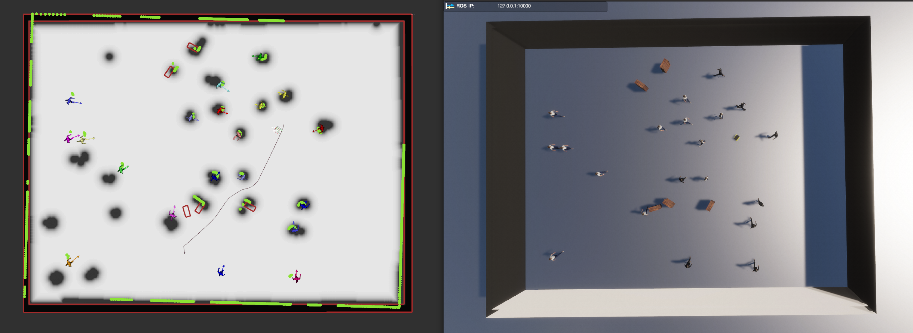

# Laser Scan and Dynamic Configuration


<sub>Visualization of the Laser Scan Sensor in Arena Unity</sub>

## Laser Scan Sensor

### Overview
The `LaserScanSensor` class is responsible for simulating a laser scan sensor in Unity and publishing scan data to a ROS topic. This documentation explains how the laser scan works and its main functionalities.

### How It Works

- **Initialization**: The sensor is initialized in the `Start()` method.
    - Registers a ROS publisher for the laser scan topic.
    - Sets the next scan time based on the publish period.
- **Configuration**: The `ConfigureScan` method configures the sensor's parameters.
    - Sets the range, update rate, angles, and number of measurements based on a provided dictionary.
- **Scanning Process**:
    - **Begin Scan**: Starts a new scan and initializes the scanning state.
    - **Do Scan**: Performs the actual measurement by casting rays within the configured angles and range.
    - **End Scan**: Ends the scan, processes the results, and publishes them to the ROS topic.
- **Publishing**: The scan results include metadata like range, angles, and timestamp, and are published as a `LaserScanMsg` to the ROS topic.

### Key Parameters

- `RangeMetersMin`: Minimum range of the sensor.
- `RangeMetersMax`: Maximum range of the sensor.
- `ScanAngleStartDegrees`: Starting angle of the scan.
- `ScanAngleEndDegrees`: Ending angle of the scan.
- `NumMeasurementsPerScan`: Number of measurements taken per scan.
- `PublishPeriodSeconds`: Time interval between scans.
- `frameId`: Frame ID for the ROS message.

### Example Usage

```csharp
LaserScanSensor laserScan = laserLinkJoint.AddComponent<LaserScanSensor>();
laserScan.topicNamespace = "namespace/robot";
laserScan.ConfigureScan(laserConfig);
```

## Dynamic Configuration for Laser Scan Sensor

### Overview

This section explains how the laser scan sensor can be dynamically configured using a YAML configuration file. It describes the logic for attaching the sensor and configuring it based on the file contents.

### Configuration File Structure

An example configuration file (`robot.model.yaml` for jackal) looks like this:

```yaml
plugins:
  - type: Laser
    name: static_laser
    frame: front_laser
    topic: scan
    body: base_link
    broadcast_tf: true
    origin: [0.0, 0.0, 0.0]
    range: 30.0
    angle: { min: -2.35619, max: 2.35619, increment: 0.00654497222 }
    noise_std_dev: 0.0
    update_rate: 10
```

### Logic for Attaching and Configuring the Laser

- **Spawning the Robot**: The `SpawnRobot` method handles the overall process.
    - Loads the robot model and configurations.
    - Sets up necessary components like the drive and odometry publishers.
- **Loading Configurations**:
    - `LoadRobotModelYaml` reads the robot model configuration from a YAML file (includes laser config).
    - `LoadRobotUnityParamsYaml` reads Unity-specific parameters (includes RGBD sensor config and collision sensor config).
- **Attaching the Laser Sensor**: The `HandleLaserScan` method handles the overall process. 
    - Finds the appropriate frame to attach the laser sensor (based on laser plugin config).
    - Adds the `LaserScanSensor` component to the specified frame.
- **Configuring the Sensor**:
    - The `ConfigureScan` method sets the sensor parameters based on the configuration dictionary (from the laser plugin config).

### Example Usage

```csharp
RobotConfig config = LoadRobotModelYaml("robot_name");
HandleLaserScan(robot, config, "robot_namespace");
```
