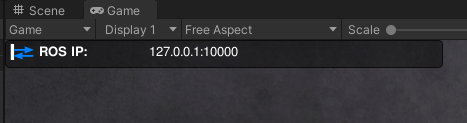

## How to Develop and Extend Arena Unity
To do development on Arena Unity you need Unity and the correct Unity Editor version. For this you will also need to create a Unity account in order to have a Unity license.

**Getting Unity Hub and a Unity license**:  
You need to install Unity Hub by following the steps in [this manual](https://docs.unity3d.com/hub/manual/InstallHub.html#install-hub-linux) but do not install a Unity Editor yet. You will also need to create a Unity  Account, if you don't already have one, for the Unity license.

**Installing the correct Unity Editor**:  
For this project, we use the Unity Editor version 2022.3.11f1. To install this version, execute the install-unity-version.sh script  in *\[catkin_ws\]/src/arena/arena-unity* :
```sh
./install-unity-version.sh
```

Now, you can start developing, by opening the project path *\[catkin_ws\]/src/arena/arena-unity* in the Unity Hub and in your favourite code editor.  
For development it's easier to test changes in Arena Unity by starting the Unity Simulator from the Unity Editor (i.e. simply pressing *play* in the Unity Editor, without having to build it first). The simulation will then run in the *Game* Tab and all that is left to do is start Arena Rosnav with the additional argument *development_mode* for the launch command:
```sh
roslaunch arena_bringup start_arena.launch simulator:=unity tm_obstacles:=scenario tm_robots:=scenario model:=jackal development_mode:=true 
```
This will stop Arena Rosnav from running the executable build of Arena Unity but instead waits for you to start it yourself (by pressing *play* as mentioned above). The order in which you start Arena Rosnav and press *play* in the Editor does not matter.

It is working if you see a blue ROS connection icon in the left upper corner of the Game Preview:


