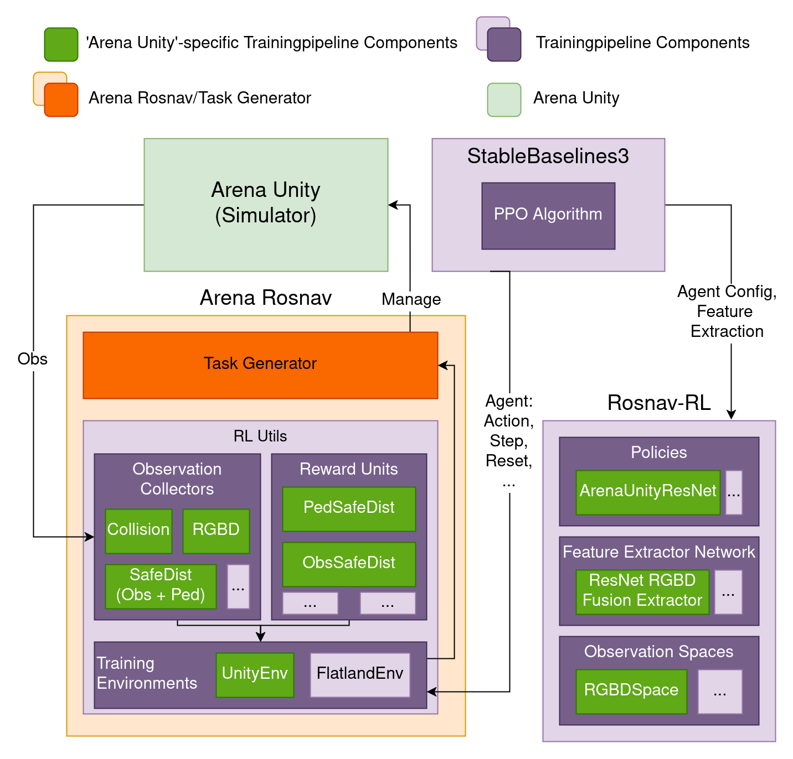
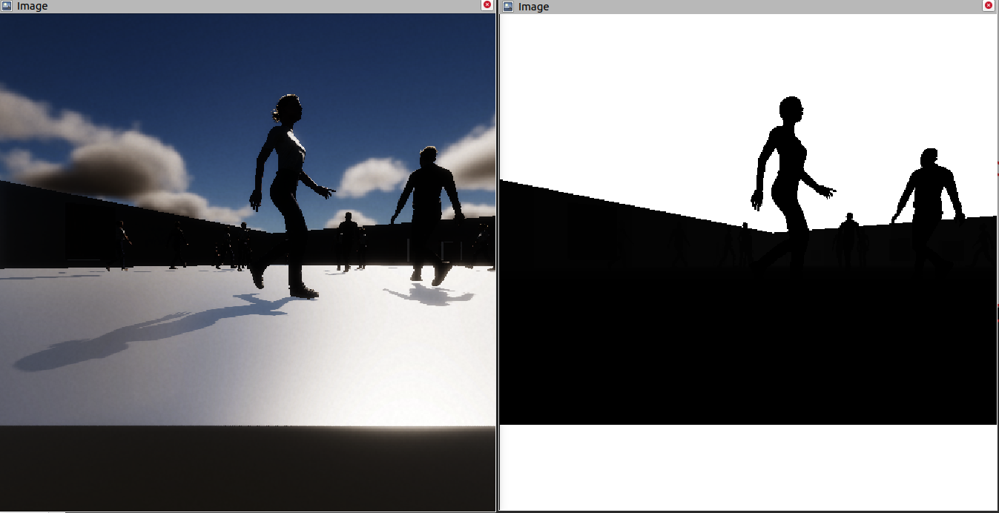
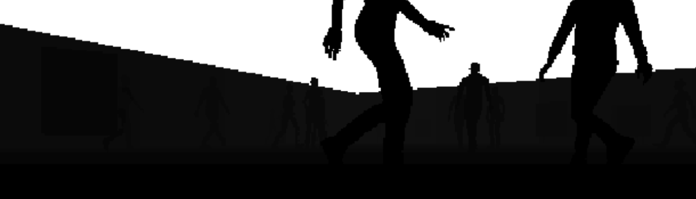
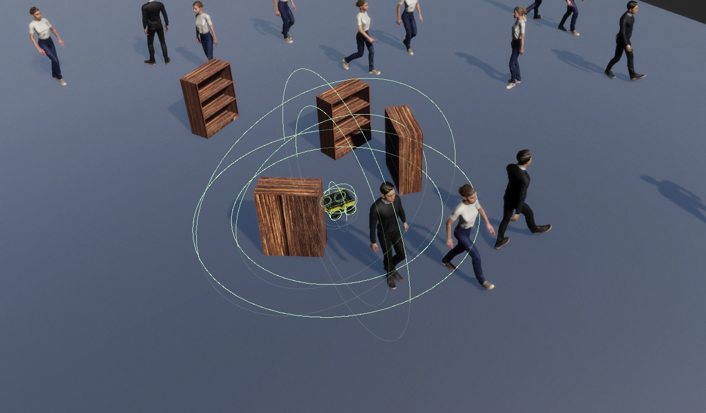
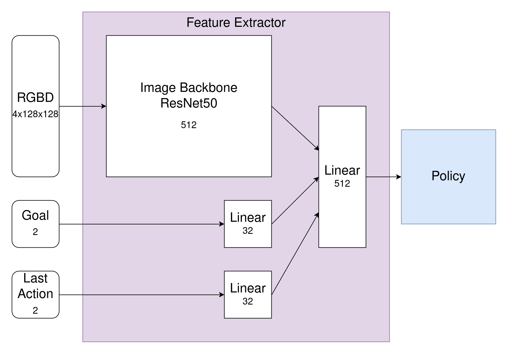

# Arena Unity Training Integration

This page includes information about the integration of Arena Unity into the training pipeline, including feature overviews and technical details. If you want to use Arena Unity for training, refer to this [guide](train_with_arena_unity.md).  
Arena Rosnav previously only supported training of deep reinforcement learning agents in the Flatland simulator.  
Arena Rosnav has a sophisticated training pipeline in place (its main documentation can be found [here](../../user_guides/training/training.md)). To integrate Arena Unity as an additional simulator for training DRL agents we needed to:

- Extend the existing training pipeline by 'Arena Unity'-specific features, like 'Arena Unity'-specific observations and reward functions 
- Create a completely new training environment for the training pipeline to interact with Arena Unity
- Find a way to synchronize the training step rate with the Arena Unity continuous-time simulation
- Integrate the launch of Arena Unity in the training launch workflow 
- Create a new feature extractor network to support feature extraction of RGBD data 
- Integrate a "simulation speed" variable to fully leverage compute ressources

Area Unity Training Integration Graphic  
This image shows all completely 'Arena Unity'-specific components (in green) within the Arena Rosnav DRL training pipeline.

## 'Arena Unity'-specific Observations & Rewards

#### Image

RGB and Depth Image Visualization in Rviz.  

Same image as above but zoom-in on depth image.  
Most important, we implemented a RGBD sensor in Arena Unity to leverage the photo-realsim of Unity with its HD-Renderpipeline. RGB and depth act as independent observations and processing logic was implemented in the Arena Rosnav training pipeline.

#### Enhanced Collision Detection

3 Collision and Safe Dist Sensors Visually Represented by Spheres  
Based on our Arena Unity `CollisionSensor` (see the `CollisionSensor` documentation [here](collision_sensor.md)), we are able to efficiently and accurately detect collisions. During training, we previously relied on an additional designated laser scan to detect whether a collision of the robot with another object took place. Now we can accurately and efficiently detect collisions with the Unity collider component in the back-end. This observation acts as an enhancement to previous collision logic.

#### Pedestrian-specific Safety Distance
A new observation which can detect safety distance violations specifically with pedestrians. This is also based on the Arena Unity `CollisionSensor`. We added a reward function specifically for pedestrian safety distance where reward value and safety distance can be set.

#### Obstacle-specific Safety Distance
Similiar to pedestrian-specific safety distance, obstacle-specific safety distance can be set to a certain distance and observations will be generated accordingly. It also uses the Arena Unity `CollisionSensor` and is used for a new corresponding reward.

## Arena Unity Environment

Each simulator needs an environment for the training algorithm from StableBaseline3 to interact with. The key components are:

- **Initialization**
    - Initialize the simulation.
    - Observation manager.
    - Reward manager.

- **Interaction Methods**
    - Implement `step` and `reset` methods.
    - Generate observations.
    - Execute agent actions.
    - Calculate rewards.

- **Unity-Specific Setup**
    - Compared to the Flatland Environment, Arena Unity requires:
        - A different setup of simulation, obstacle manager and reward manager.
        - A method to synchronize between the simulation and the training step rate.
    - Dedicated synchronization logic (explained in the next section).

## Synchronization

For synchronization, a new module `UnityTimer` was created. The synchronization process includes:

- **Threading Event**
    - Uses a threading event to wait until the next step rate interval is reached.
    - Utilizes the namespace-specific Arena Unity clock.
    - ROS subscriber callback to update the current time.

- **Synchronization Logic**
    - Ensures proper synchronization even when in-game simulation time runs at different rates than real time.
    - Logs warnings if the target training/step rate is not reached.
    - Allows users to adjust simulation load (e.g., slower speed, fewer parallel environments, fewer obstacles/pedestrians).

## Training Speed

The Unity Eninge allows control over the physics engine's speed through a time scale parameter:

- **Time Scale Argument**
    - Adjusts the speed of the physics engine.
    - A new time scale launch parameter was added to the Arena Unity launch.

- **Automatic Adjustment**
    - Training synchronization logic automatically adjusts to the time scale.
    - Not yet stable as the Pedsim Simulator needs modification to align with the simulation clock rather than the wall clock, which currently breaks Gazebo.

## Agent Design – ArenaUnityResNet

Arena Unity ResNet Agent Design for RGBD Data

Rosnav-RL agent designs consist of a feature extraction part and the policy part (which is implemented in sb3). The ArenaUnityResNet feature extractor addresses the need for a new agent architecture due to the high dimensionality of RGBD data compared to laser data. The key aspects are:

- CNN PPO policy.
- Feature extractor inspired by "DD-PPO: Learning Near-Perfect PointGoal Navigators from 2.5 Billion Frames".
- Modular architecture consisting of:
    - **Image Backbone/Feature Extractor**
        - ResNet50 was used.
        - Can be interchanged with any ResNet (e.g., ResNet151, SE-ResNeXt50).
    - **Goal Feature Extractor**
    - **Last Action Feature Extractor**

## Observation Integration

Integration of observation logic for Arena Unity in the training pipeline involves the following components:

- **Observation Space Integration**
    - Arena Rosnav DRL Agents use feature extractor networks as input for PPO.
    - Feature extractors are implemented in the rosnav-rl repository, where the observation spaces are also defined.
    - Feature extractor networks' dimensionality is parameterized by the observation spaces.
    - Observation spaces encode dimensionality and encapsulate the encoding process.
        - Collected observation values are encoded into specific formats for input to feature extractors.

- **Unity-Specific Integration**
    - Added RGBD observation space for Arena Unity.
    - RGBD space combines RGB image data and Depth image data into a 4x[Image Height]x[Image Width] tensor.

- **Observation Collectors**
    - Managed by the ObservationManager.
    - Handle ROS subscriptions, collection, and preprocessing of observations.
    - Specific observation collectors for each observation, implemented as ObservationCollectorUnit classes.
        - Preprocess received messages to obtain observations.

- **Unity-Specific Observation Collectors**
    - Implemented collectors for Unity-specific observations:
        - Collision observation collector.
        - Image collectors (RGB, Depth).
            - Use cv_bridge to convert ROS images to numpy arrays.
        - Safety distance collectors (Obstacle-specific, Pedestrian-specific).
            - Store flags in CollisionMsg object for safety distance violations/collisions.

- **Waiting for Observations**
    - Implemented mechanism to wait for new observations in continuous time.
        - Observation values are set as stale after retrieval until a new observation arrives.
        - Two parameters decide whether to use stale observation values:
            - "wait_for_obs" (TRUE for Arena Unity simulator).
            - "up_to_date_required" (observation-specific flag).

# Reward Integration

Rewards in the training process are organized into modular Reward Units, each rewarding a specific behavior or event. The Unity-specific rewards include:

- **Pedestrian Safety Distance & Obstacle Safety Distance**
    - Two separate Reward Units.
    - Reward given if the specified safety distance towards pedestrians/obstacles is breached.
    - Each unit can be set up with specific safety distances and reward values.
    - Initialization includes a service request to Arena Unity for the attach_safe_dist_sensor service.

- **Collision**
    - Enhanced Collision Reward Unit using Collision observation from Arena Unity's CollisionSensor.