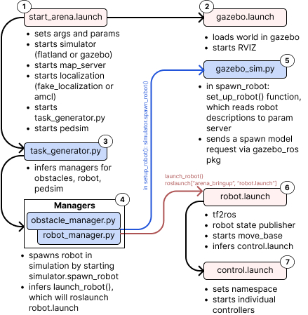

# Launch File Design
All functionalities are loaded in and started via ROS launch files in xml description. As arena provides a high number of functionalities, those launch files could increase in size and difficult to understand. In this chapter, the workflow and ideas for different use cases are illustrated and explained. There are two different modes which you can operate: testing and training. While training is to train DRL approaches mostly in the 2D Flatland simulator, testing refers to testing different approaches which is possible on multiple simulators. Normally, you would also use the testing mode as a playground to test your 

## Testing Mode 
The following workflow diagram illustrates the launch files and classes that are started when executing a testing run with the command: 

```sh
roslaunch arena_bringup start_arena.launch pedsim:=true simulator:=gazebo task_mode:=scenario scenario_file:=scenario_2.json map_file:=map_empty local_planner:=teb model:=jackal
```


<div align="center">
    
</div>

`arena_bringup/start_arena.launch` will set all arg and parameters necessary for the simulation and starts `gazebo.launch`, which will load in the gazebo world and start RVIZ. `start_arena.launch` will also start the map server, localization and task manager. The task manager will then start the other processes.
