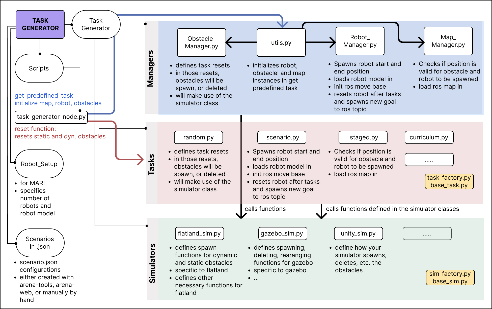

[Task-manager]: ../images/system-design/task-manager-system-design.jpg "example image"

# System Design 
Arena-rosnav (arena) is implemented in a modular way with each class being outsourced into a seperate repository (different from the [first version of Arena-rosnav](https://github.com/ignc-research/arena-rosnav-3d)). The core repo is called arena-rosnav, which will install all other necessary modules. Figure 1 visualizes the general system design with all modules of the arena ecosystem. The following subsections, will provide a more detailed look into each of those modules. For instructions on how to work with and/or extend them, the [Tutorials](../tutorials/) chapter provides more detailed explanations. 

## The Task Manager
The task manager is one of the main and most important components of the Arena platform. It is responsible to generate different task setups such as randomly populated scenarios. It also initializes the robot and planners by infering the respective manager classes such as the robot_manager.py or the obstacle_manager.py. Overall there are different task types currently provided, which are explained in more detail in [x]().
In the following [Figure 2][Task-manager], illustrates all modules within the task manager folder and how they interconnect. 

