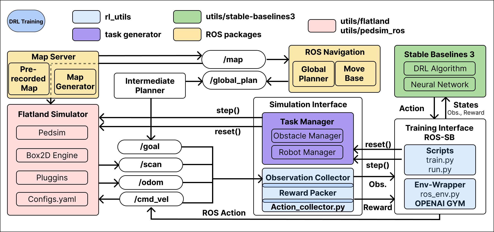

# Training
Another important function of arena is the training of DRL agents. Therefore, a complex and profound training pipeline is provided, which facilitates training of DRL agents with state-of-the-art algorithms. The most commonly used libraries such as Gym or Stable baselines are utilized and there exist a number of options to customize training or extend the functionalities. For a profound explanation on how to use and start a training run, we refere to [x](). A detailed explanation how to extend the training class e.g. add new architectures, new robots, etc., we refere to [x]().

## System Design of The Training Pipeline
In the following figure, the system design is illustrated.

