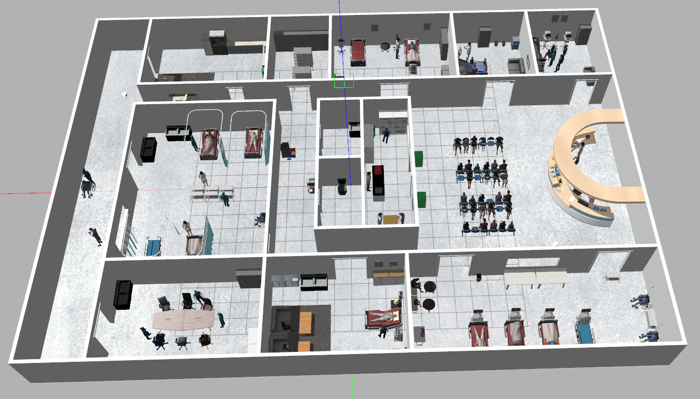
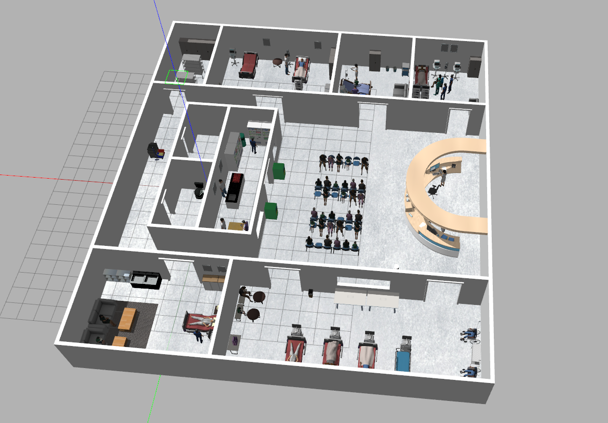
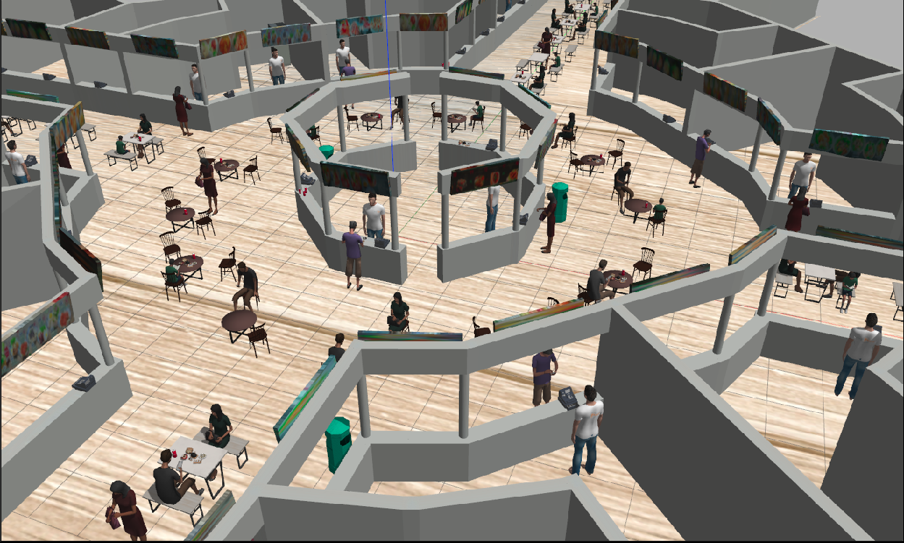
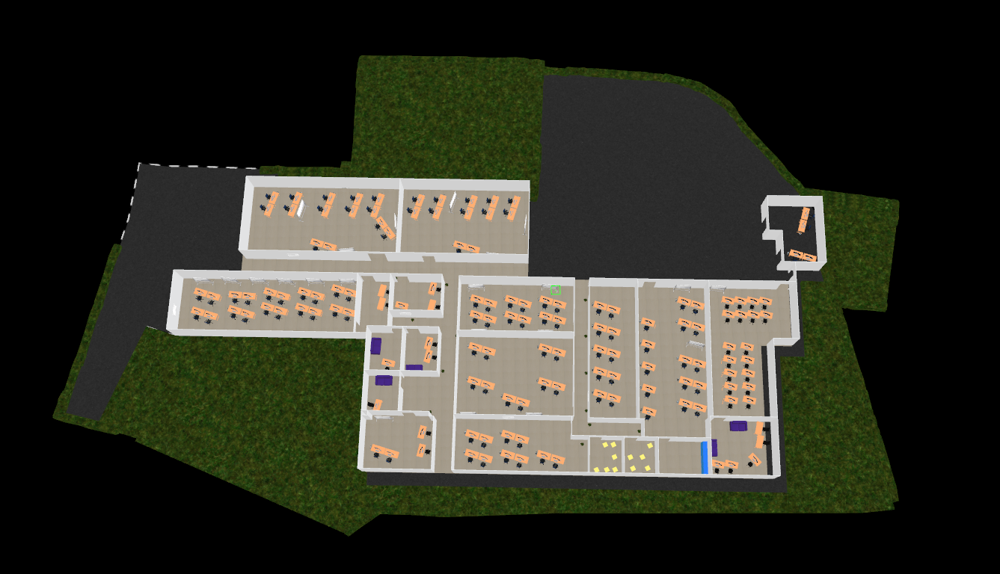
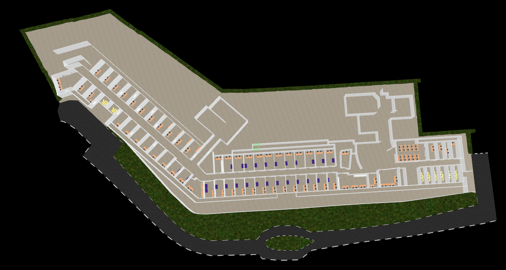
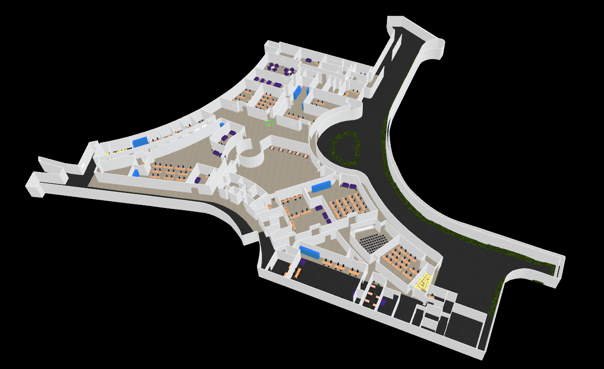

## Deploying A Robot In Different Environments Using Gazebo As The Simulator

Gazebo is an open-source 3D simulation environment that facilitates the creation of realistic scenarios, including the simulation of sensors, robot dynamics, and interaction with objects in a simulated environment. Due to its popularity in the field of robotics, numerous custom worlds are already available. For simulations, we provide diverse environments, including hospitals, warehouses, hawker centers, and campuses. Additionally, we offer a variety of robots such as Jackal, TurtleBot3, Robotino, and more. To simulate the movement of humans, we employ PedSim as dynamic obstacles. Further information can be found in our User Guides section.

**Task Generator Config File**

We create a task generator configuration file to modify various task mode settings.   
This file can be found in the following directory:

```python
/arena-rosnav/arena_bringup/configs/task_generator.yaml
```

| Task Modes  | Settings        | Description      |
|----------   |----------       |----------        |
| random      | static, interactive, dynamic       | The random task mode creates static and dynamic obstacles randomly in the world. In the static settings, inside the task generator config file, you can set the maximum and minimum numbers of randomly spawned static objects. The task generator will then create a random number between the minimum and maximum value. In the dynamic settings, you can set maximum and minimum numbers of randomly spawned dynamic agents. The task generator will then create a random number between the minimum and maximum value. In the random task mode, the robot is assigned a random start and goal position. After the robot reaches the goal, a new start and goal pose will be assigned and new static and dynamic obstacles will be placed randomly in the world. The number of desired resets can be set with the desired_resets flag. |
| scenario    | scenario_file                      | The random task mode is designed for evaluation in the first place. In the scenario file dynamic and static obstacles as well as the start and goal position of the robot are defined.                                                                              |
| staged      | curriculum, starting_index         | The staged task mode is designed for training processes. In general, it behaves like the random task mode. You can set the number of randomly spawned dynamic and static objects. The difference from the random task mode is that there are multiple stages. In each stage, a different number of dynamic and static objects can be set. If the robot successfully completes the first stage, the next stage will be triggered. The amount of obstacles is defined in a curriculum file. |

#### Worlds

We provide our own worlds:

|  |  |  | 
| :--------------------------------------------------------------: | :---------------------------------------------------------------------: | :--------------------------------------------------------------------: | 
|                           arena_hospital_large                            |                           arena_hospital_small                            |                           arena_hawker_centre                            |            

|  |  |  | 
| :-------------------------------------------------------------: | :---------------------------------------------------------: | :---------------------------------------------------------------: |
|                           arena_nus_com1                           |                     arena_nus_com2                      |                            arena_nus_com3                            |                       

### Arena Hospital Large

<link rel="stylesheet" href="https://cdnjs.cloudflare.com/ajax/libs/clipboard.js/2.0.8/clipboard.min.css">


### Arena Hospital Small

<link rel="stylesheet" href="https://cdnjs.cloudflare.com/ajax/libs/clipboard.js/2.0.8/clipboard.min.css">


### Arena Hawker Centre

<link rel="stylesheet" href="https://cdnjs.cloudflare.com/ajax/libs/clipboard.js/2.0.8/clipboard.min.css">


### Arena National University Of Singapur COM1 Building

<link rel="stylesheet" href="https://cdnjs.cloudflare.com/ajax/libs/clipboard.js/2.0.8/clipboard.min.css">


### Arena National University Of Singapur COM2 Building

<link rel="stylesheet" href="https://cdnjs.cloudflare.com/ajax/libs/clipboard.js/2.0.8/clipboard.min.css">


### Arena National University Of Singapur COM3 Building

<link rel="stylesheet" href="https://cdnjs.cloudflare.com/ajax/libs/clipboard.js/2.0.8/clipboard.min.css">


