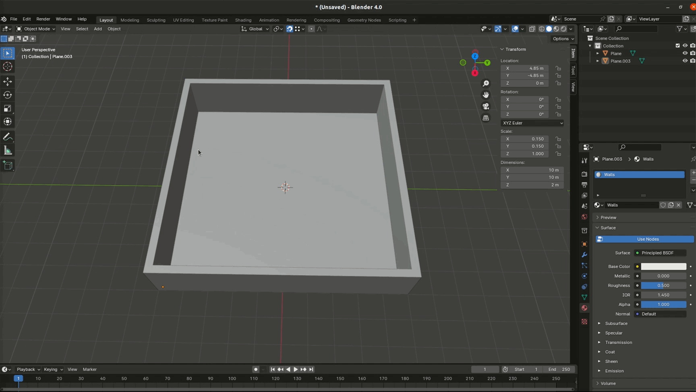
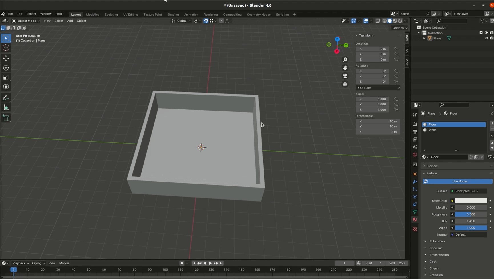
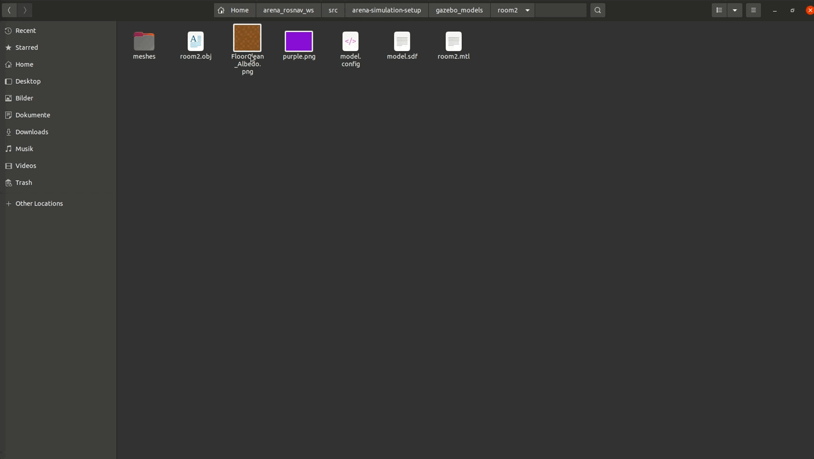
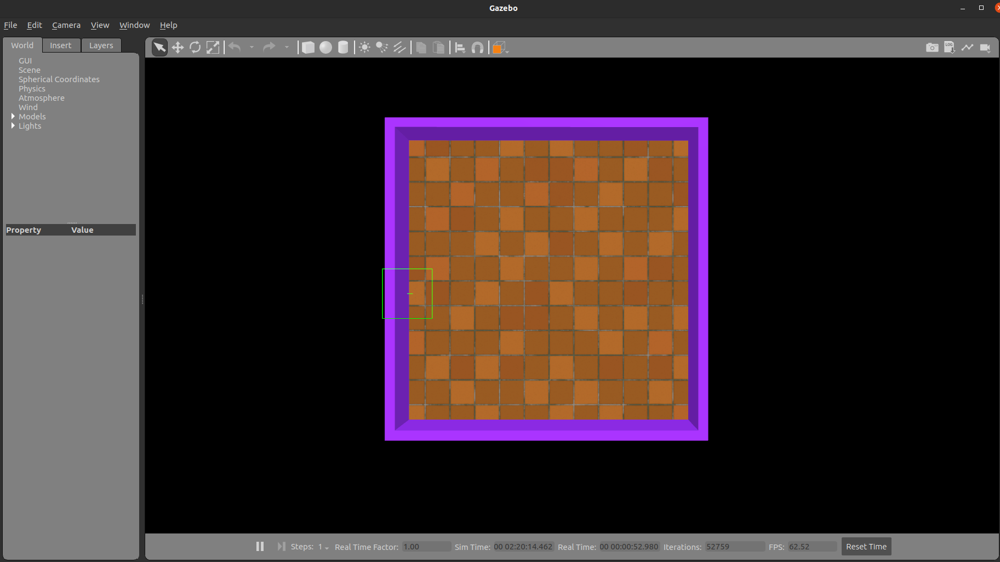
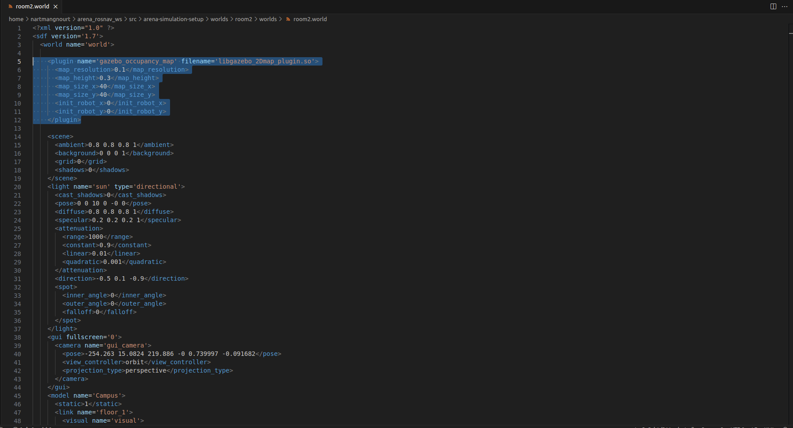
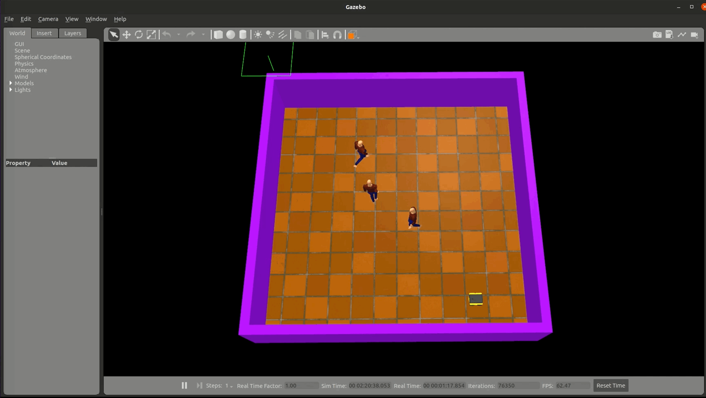

## Generate A World In Gazebo For Arena-Rosnav (Gazebo 11)

There are several ways to create worlds in Gazebo. The first option is to use the built-in Gazebo Building Editor. Walls can be created directly in Gazebo using this editor. After creating the walls, models such as chairs, tables, and shelves can be placed directly in Gazebo. This is the fastest way to create a world in Gazebo.
<br>
The second option is Blender, which offers a lot of flexibility and resource savings but requires considerably more effort.

### Generate a World directly in Gazebo with the built-in tool

Note: Start Gazebo always in your terminal.

**How to create a World in gazebo**

Start gazebo with the following command:

```python
roslaunch arena_bringup start_generate.launch 
```

After starting Gazebo, navigate to the 'Edit' option in the top-left tab, and then choose 'Building Editor'.  
<br>
      

On the left sidebar, select the 'Wall' button. Now, you can create walls in the checkered area. The bottom window shows you a preview of how your model looks in Gazebo. In order to move the view up, down, left and right in the bottom window, hold the left mouse button in the viewport.
In order to rotate the view, hold shift and the left mouse button in the viewport.
<br>
<br>
      

By clicking two times on a wall, the 'Wall Inspector' will open up. Here, you can change different settings such as length, height, and thickness.
<br>
<br>
  

If you don't specify a location to save your file, Gazebo will create a folder with the name 'building_editor_models' in your home directory and place your model inside of this folder.
<br>
Therefore, change the directory to:
<br>
`../arena-simulation-setup/gazebo_models`
<br>
<br>
 
 

**How to add new Models?**
<br>
<br>
You can add new models in the following directory inside of your arena rosnav workspace:<br>
`../arena-simulation-setup/gazebo_models`
<br>
Put your model that your created above inside the *gazebo_models* folder. Now, your model should be available for use. 
<br>
<br>
 

**How to save your world?**
<br>
<br>
Safe your world with a .world end tag
<br>
<br>
      

Create a folder with the same name as your .world file in the following directory:
<br>
`../arena-simulation-setup/worlds`
<br> 
Next, create a folder with the name 'world' inside the folder you just created. Put your .world file into this folder. Don't forget to do catkin_make in your arena rosnav workspace. 
<br>
<br>
       


**How to create a Occupancy grid map ?**

In order to convert the gazebo world into a 2D occupancy grid map, include the gazebo_ros_2Dmap_plugin into the .world file. Adjust `<map_size_x>` and `<map_size_y>` according to the size of your map. 
```python
    <plugin name='gazebo_occupancy_map' filename='libgazebo_2Dmap_plugin.so'>
      <map_resolution>0.1</map_resolution>
      <map_height>0.3</map_height>
      <map_size_x>10</map_size_x>
      <map_size_y>10</map_size_y>
      <init_robot_x>0</init_robot_x>
      <init_robot_y>0</init_robot_y>
    </plugin>
```
 

In order to create the occupancy grid map, launch the following command:

Note: It is mandatory that you pass the name of your world as an argument (e.g. `world_name:=test_world`). 

```python
roslaunch arena_bringup start_generate.launch world_name:=<your_world_name>
```

You can close gazebo for now. 

Inside the `../arena-simulation-setup/maps` directory, a folder with the name of your world should be created. The Folder contains the following files:

- *.pgm File*             : This file is the occupancy grid map.
- *.yaml File*            : Here you can modify some parameters of the occupancy grid map. 
- *map.world.yaml File*   : This file is necessary for the Flatland simulator. 


**Testing**

Test your world by passing the name of your world as an argument(e.g. `map_file:=test_world`):

```python
roslaunch arena_bringup start_arena.launch map_file:=<your_world_name> simulator:=gazebo model:=jackal local_planner:=teb 
```
<br>
  


### Generate a World in Gazebo with a .obj file in Blender

In order to move the view up, down, left and right, hold the [shift+alt] then hold the left mouse button in the viewport. In order to rotate the view, hold [alt] then the left mouse button in the viewport.
First create a plane [shift+a]. This will be the floor of your building. You can press [n] to scale the dimensions of your floor. 
<br>
<br>
  


Next, we will create the walls. Add another plane and scale the dimensions. Press snap (magnet symbol) and select vertex (Vertex are the little dots. You can see the dots in edit mode. In order to to enter the edit mode , select the plane and press tab).
<br>
<br>
  

Select your wall plane (in object mode), press [g] and move your wall plane at the edge of your floor plane. Your wall plane vertex will automatically snap on the edge vertex of your floor plane. 
<br>
<br>
  


Next, select your wall plane, go to edit mode and select the 2 vertex of your wall plane. Press [e] then [x] to extrude your plane in the x direction and snap it on the edge of the floor plane (press [y] instead of [x] if you want to extrude your wall plane in the y direction). You can press [g] then [x] to adjust the length in x direction. Extrude your wall plane again and snap it on the edge of the floor plane. Repeat this process until you finished with the shape of your walls.    
<br>
 

Select 'faces' in the top corner inside edit mode. Select all parts of your wall (hold shift to select multiple parts). Press [e] (then [2] and [enter] if your wall should be 2 meter tall) to extrude your walls in z direction.
<br>
<br>
 

In order to apply texture on your objects, you have to select the object (in object mode) and go to 'Material' on the left. Add a new material and provide a name for your object. 
<br>
<br>
 

Next, join you objects together. Select both objects and press [strg] and [j]. 
<br>
<br>
 

Finally, you have to rotate your object because Blender and Gazebo are using a different coordinate system. Rotate your object by 90 degrees in x direction.
<br>
<br>
 

After you finished with your model, save your model as a .obj file. You will get a '.obj' and a '.mtl' file. 
<br>
<br>

<br>
<br>
 

Create a folder for your model in the directory : 
`../arena-simulation-setup/gazebo_models`
<br>
Create a 'meshes' folder, a 'model.config' file and a 'model.sdf' file inside of the new folder that you just created. 
<br>
<br>
 

Put your '.obj' file, '.mtl' file and your textures inside of the 'meshes' folder. 
<br>
<br>
 

In the `model.config` file are informations about the maintainer and creator of the model.
```xml
<?xml version="1.0"?>
<model>
  <name>room2</name>
  <version>1.0</version>
  <sdf version="1.6">model.sdf</sdf>

  <author>
    <name>Nam Truong Tran</name>
    <email>trannamtruong98@gmail.com</email>
  </author>

  <description>
    room2 model. 
  </description>
</model>
```

In the `model.sdf` file are settings about the model and the path. Adjust the path according to your model. 
```xml
<?xml version="1.0" ?>
<sdf version="1.7">
  <model name="room2">
    <static>true</static>
    <link name="floor_1">
      <visual name="visual">
        <pose>0 0 -0.25 0 0 0</pose>   
        <geometry>
          <mesh>
            <uri>model://room2/meshes/room2.obj</uri>
          </mesh>
        </geometry>
      </visual>
      <collision name="collision">
        <pose>0 0 -0.25 0 0 0</pose>   
        <geometry>
          <mesh>
            <uri>model://room2/meshes/room2.obj</uri>
          </mesh>
        </geometry>
      </collision>
    </link>
  </model>
</sdf>
```


In order to change the texture of your floor and your walls or other parts of your model, open the `.mtl` file and add the texture.
<br>
```xml
map_Kd <your_texture>
```
 

In the last step, you have to create a `.world` file in the following directory: 
<br>
`arena-simulation-setup/worlds/<your_world>/worlds`
<br>
<br>
 

Copy and paste these lines into you `.world` file:

```xml
<?xml version="1.0" ?>
<sdf version='1.7'>
  <world name='world'>
    <plugin name='gazebo_occupancy_map' filename='libgazebo_2Dmap_plugin.so'>
      <map_resolution>0.1</map_resolution>
      <map_height>0.3</map_height>
      <map_size_x>40</map_size_x>
      <map_size_y>40</map_size_y>
      <init_robot_x>0</init_robot_x>
      <init_robot_y>0</init_robot_y>
    </plugin>
    <scene>
      <ambient>0.8 0.8 0.8 1</ambient>
      <background>0 0 0 1</background>
      <grid>0</grid>
      <shadows>0</shadows>
    </scene>
    <light name='sun' type='directional'>
      <cast_shadows>0</cast_shadows>
      <pose>0 0 10 0 -0 0</pose>
      <diffuse>0.8 0.8 0.8 1</diffuse>
      <specular>0.2 0.2 0.2 1</specular>
      <attenuation>
        <range>1000</range>
        <constant>0.9</constant>
        <linear>0.01</linear>
        <quadratic>0.001</quadratic>
      </attenuation>
      <direction>-0.5 0.1 -0.9</direction>
      <spot>
        <inner_angle>0</inner_angle>
        <outer_angle>0</outer_angle>
        <falloff>0</falloff>
      </spot>
    </light>
    <gui fullscreen='0'>
      <camera name='gui_camera'>
        <pose>-254.263 15.0824 219.886 -0 0.739997 -0.091682</pose>
        <view_controller>orbit</view_controller>
        <projection_type>perspective</projection_type>
      </camera>
    </gui>
    <model name='Campus'>
      <static>1</static>
      <link name='floor_1'>
        <visual name='visual'>
          <pose>0 0 -0.25 0 -0 0</pose>
          <geometry>
            <mesh>
              <uri>model://room2/meshes/room2.obj</uri>
            </mesh>
          </geometry>
        </visual>
        <collision name='collision'>
          <pose>0 0 -0.25 0 -0 0</pose>
          <geometry>
            <mesh>
              <uri>model://room2/meshes/room2.obj</uri>
            </mesh>
          </geometry>
          <max_contacts>10</max_contacts>
          <surface>
            <contact>
              <ode/>
            </contact>
            <bounce/>
            <friction>
              <torsional>
                <ode/>
              </torsional>
              <ode/>
            </friction>
          </surface>
        </collision>
        <self_collide>0</self_collide>
        <enable_wind>0</enable_wind>
        <kinematic>0</kinematic>
      </link>
      <pose>83.7385 -50.3184 0 0 -0 0</pose>
    </model>
    <gravity>0 0 -9.8</gravity>
    <magnetic_field>6e-06 2.3e-05 -4.2e-05</magnetic_field>
    <atmosphere type='adiabatic'/>
    <physics type='ode'>
      <max_step_size>0.001</max_step_size>
      <real_time_factor>1</real_time_factor>
      <real_time_update_rate>1000</real_time_update_rate>
    </physics>
    <wind/>
    <spherical_coordinates>
      <surface_model>EARTH_WGS84</surface_model>
      <latitude_deg>0</latitude_deg>
      <longitude_deg>0</longitude_deg>
      <elevation>0</elevation>
      <heading_deg>0</heading_deg>
    </spherical_coordinates>
    <state world_name='world'>
      <sim_time>8361 703000000</sim_time>
      <real_time>341 876325987</real_time>
      <wall_time>1700178190 717198558</wall_time>
      <iterations>339450</iterations>
      <model name='Campus'>
        <pose>0.47498 -2.52106 0.250000 0 -0 0</pose>
        <scale>1 1 1</scale>
        <link name='floor_1'>
          <pose>0.47498 -2.52106 0.250000 0 -0 0</pose>
          <velocity>0 0 0 0 -0 0</velocity>
          <acceleration>0 0 0 0 -0 0</acceleration>
          <wrench>0 0 0 0 -0 0</wrench>
        </link>
      </model>
    </state>
    <offset>22000 31500 0 0 0 0</offset>
    <crs>EPSG:3414</crs>
  </world>
</sdf>
```

You just have to replace the path of your model and the name of your model:

```xml
          <geometry>
            <mesh>
              <uri>model://<folder_name_of_your_model>/meshes/<your_model>.obj</uri>
            </mesh>
          </geometry>
        </visual>
        <collision name='collision'>
          <pose>0 0 -0.25 0 -0 0</pose>
          <geometry>
            <mesh>
              <uri>model://<folder_name_of_your_model>/meshes/<your_model>.obj</uri>
            </mesh>
          </geometry>
```
After you start Gazebo with your `.world` file, you should see your model with the texture:
<br>
<br>
 
<br>
<br>
 

Note: If you want to add models to your world, go to the above section '*How to add new models?*'. Then continue with the section '*How to save your world?*'.

**How to create a Occupancy grid map ?**

In order to convert the gazebo world into a 2D occupancy grid map, include the gazebo_ros_2Dmap_plugin into the .world file. Adjust `<map_size_x>` and `<map_size_y>` according to the size of your map.  
```python
    <plugin name='gazebo_occupancy_map' filename='libgazebo_2Dmap_plugin.so'>
      <map_resolution>0.1</map_resolution>
      <map_height>0.3</map_height>
      <map_size_x>40</map_size_x>
      <map_size_y>40</map_size_y>
      <init_robot_x>0</init_robot_x>
      <init_robot_y>0</init_robot_y>
    </plugin>
```
 

In order to create the occupancy grid map, launch the following command:

Note: It is mandatory that you pass the name of your world as an argument (e.g. `world_name:=room2`).

```python
roslaunch arena_bringup start_generate.launch world_name:=<your_world_name>
```

You can close gazebo for now. 

Inside the `../arena-simulation-setup/maps` directory, a folder with the name of your world should be created. The Folder contains the following files:

- *.pgm File*             : This file is the occupancy grid map.
- *.yaml File*            : Here you can modify some parameters of the occupancy grid map. 
- *map.world.yaml File*   : This file is necessary for the Flatland simulator. 


**Testing**

Test your world by passing the name of your world as an argument(e.g. `map_file:=room2`):

```python
roslaunch arena_bringup start_arena.launch map_file:=<your_world_name> simulator:=gazebo model:=jackal local_planner:=teb 
```
<br>
 