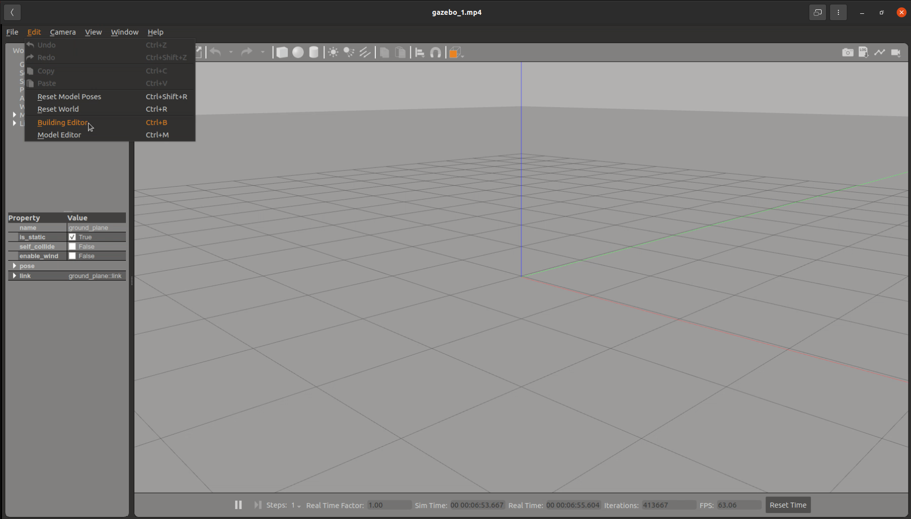
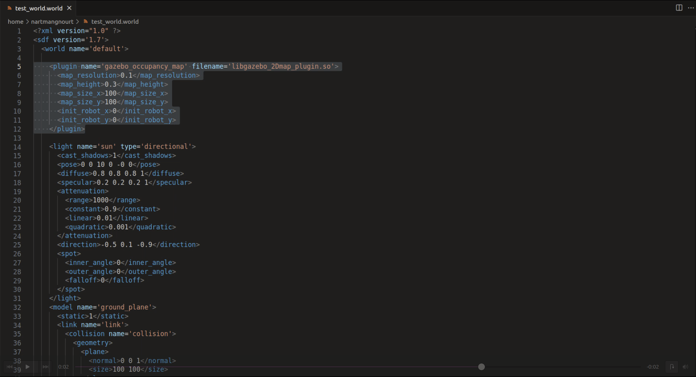

## Generate A World In Gazebo

There are several ways to create worlds in Gazebo. The first option is the built-in Gazebo Building Editor. Walls can be created directly in Gazebo using the Building Editor. After creating the walls, models such as chairs, tables, and shelves can be placed directly in Gazebo. This is the fastest way to create a world in Gazebo.
 
The second option is Blender, which provides a lot of flexibility and saves resources but requires much more effort.

### Generate a World directly in Gazebo with the built-in tool

After starting Gazebo, navigate to the 'Edit' option in the top-left tab, and then choose 'Building Editor'. 

 

On the left sidebar, select the 'Wall' button. Now you can create walls on the checkered area.
 
 
     

After you safe your file, these walls are available as models in gazebo. 
 
 
 
 

You can add new models in the following directory: home/user/.gazebo/models
 
 
 

Safe your world with a .world end tag
 
 
 

In order to convert the world into a 2D occupancy grid map, include the gazebo_ros_2Dmap_plugin into the .world file. 
 
 
   

Create a test_ws and clone the [gazebo_ros_2Dmap_plugin](https://github.com/marinaKollmitz/gazebo_ros_2Dmap_plugin) repository into the src folder. Next, create a launch file to start the gazebo world.
 
 
   

After you start the launch file, open a second terminal and call the gazebo_ros_2Dmap_plugin service with the following command: 
 
 
**rosservice call /gazebo_2Dmap_plugin/generate_map**. 
 
 
Next, save the map with the following command:
 
 
**rosrun map_server map_saver -f test_world /map:=/map2d**
 
 
You will receive a .pgm and a .yaml file. Everything is now ready for the Arena-Rosnav workspace. 
Create a folder in the path 'src/arena-simulation-setup/maps'. Next, include the .pgm and .yaml file into the maps folder. Rename both files and 'image:' (inside of the .yaml file) to map. Lastly, create a folder in the path 'src/arena-simulation-setup/worlds' and add the .world and the models into the worlds folder (take the other worlds as reference). Starting the simulation with the argument map_file:=test_world, will automatically create a distance map inside 'src/arena-simulation-setup/maps'.

### Generate a World in Gazebo with a .obj file in Blender

...

