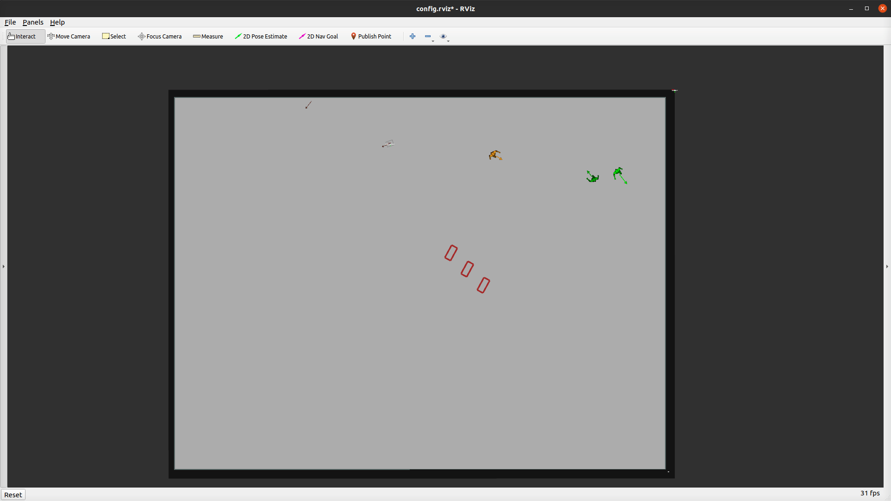

### Explore

The Explore Task Mode shares similarities with the [random task mode](random.md), but with a distinct characteristic—the obstacles are never reset. In this mode, the robot is assigned random goals, allowing it to autonomously explore the map.

e.g.

```sh
roslaunch arena_bringup start_arena.launch model:=jackal tm_robots:=explore tm_obstacles:=scenario
```


