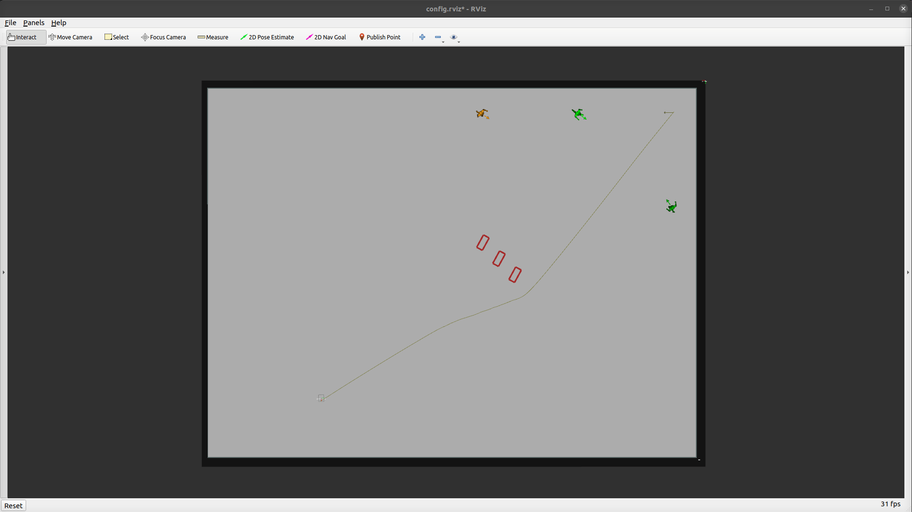

### Scenario

The scenario task will spawn the static and dynamic obstacles defined in the scenario file. Scenario files are world-dependent and are located in `arena_simulation_setup/worlds/<world>/scenarios/`

A scenario consists of 
```json
{
  "obstacles": {
    "dynamic": ["<PEDSIM AGENT DESCRIPTION>"],
    "static": [
      {
        "name": "<object name>",
        "pos": ["X", "Y", "theta"],
        "model": "<model name>"
      }
    ]
  },
  "robots": [
    {
      "start": ["X", "Y", "theta"],
      "goal": ["X", "Y", "theta"]
    }
  ]
}
```

When every robot reaches its goal, the task will be reset. 

 