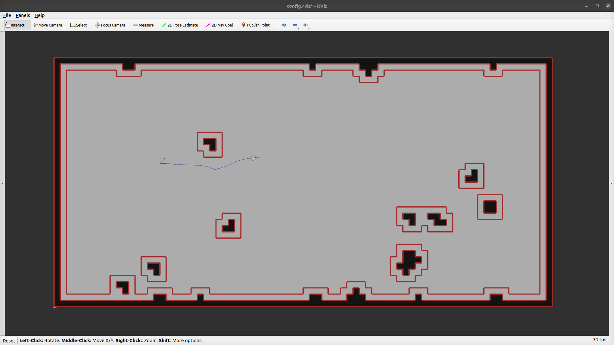

### Dynamic Map

This task mode creates a dynamic map. This task mode is loaded if the argument of `map_file` is `dynamic_map`.

e.g.
```sh
roslaunch arena_bringup start_arena.launch model:=jackal map_file:=dynamic_map
```

