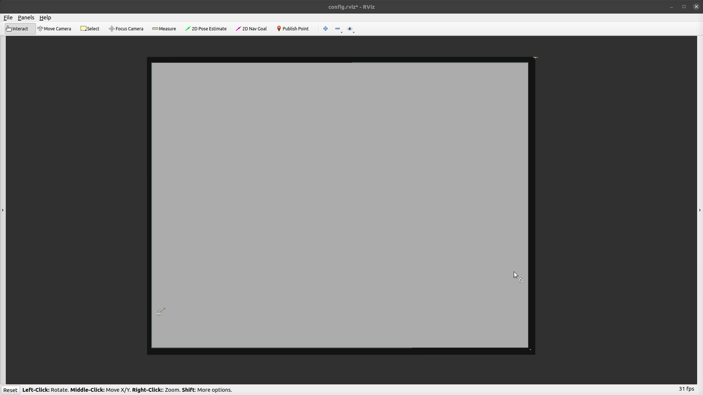

### Guided

In this task mode you can manually set a cyclical sequence of goal waypoints for the robots using rviz. The robot will start with no goal waypoints.

- Use the `2D Nav Goal` tool to append a goal position to the sequence

- Use the `2D Pose Estimate` tool to reset the robot and the waypoint sequence

The robots stay still and wait until the first goal is published. The robots also share the list of waypoints, but track them individually.
The goal sequence is tracked in rosparam `/guided_waypoints`.

e.g.

```bash
roslaunch arena_bringup start_arena.launch model:=jackal tm_robots:=guided
```

