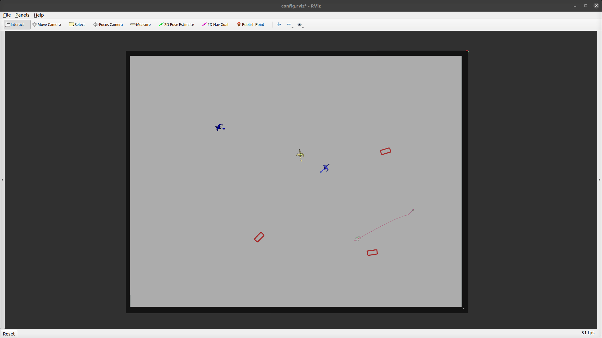

### Random

#### Obstacles

The random task spawns a random static and dynamic obstacles on every reset. The models for the spawned obstacles are randomly choosen. To change the different models that can be spawned or the amount of spawned static or dynamic obstacles change the parameter `task_mode/random` in `arena_bringup/configs/task_generator.yaml`.

e.g.

```yaml
RANDOM:
  static:
    min: 0
    max: 0
    models: ["shelf"]
  interactive:
    min: 1
    max: 5
    models: ["shelf"]
  dynamic:
    min: 1
    max: 5
    models: ["actor1"]
```

For each obstacle type, users have the flexibility to define the amount of spawnable instances (minimum and maximum amount) and the available models. To specify the amount of obstacles for a specific model, use the [Parametrized](parametrized.md) task mode.

#### Robot

The random task will create a new robot start and goal position for each task.

#### Usage

```sh
roslaunch arena_bringup start_arena.launch model:=jackal
```

