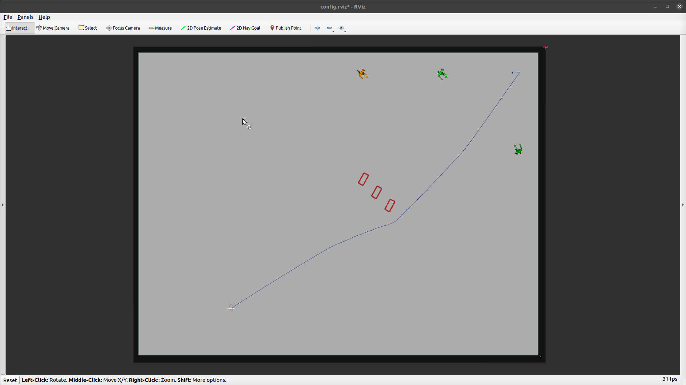
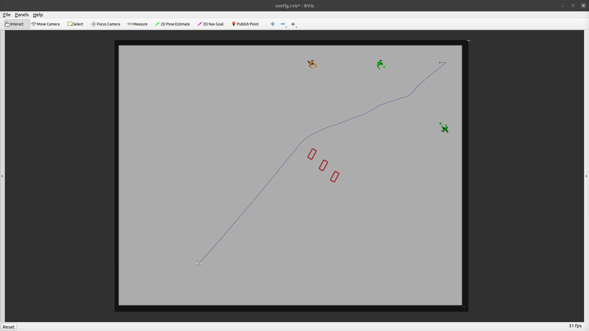
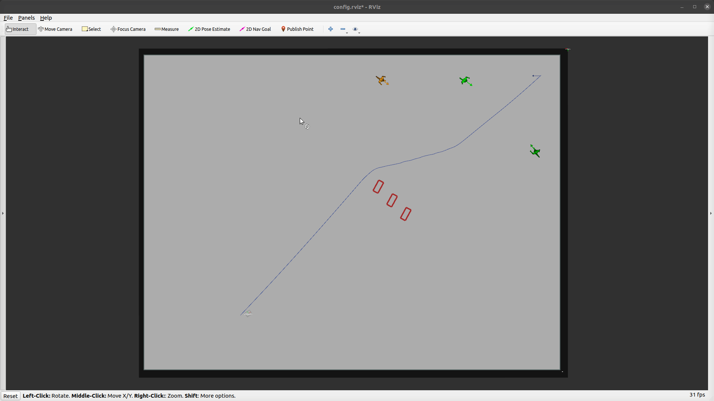

### RViz UI
The RViz UI task mode is a persistent component that is consistently loaded, providing real-time interaction and control capabilities. It actively listens to override topics and overrides the tools in the RViz UI.

The following tools are changed:

- `2D Pose Estimate`: Teleports the robot to the clicked position on the map.

 

- `2D Nav Goal`: Set a new goal for the robot's navigation.

 

- `Publish Point`: Manual reset.

