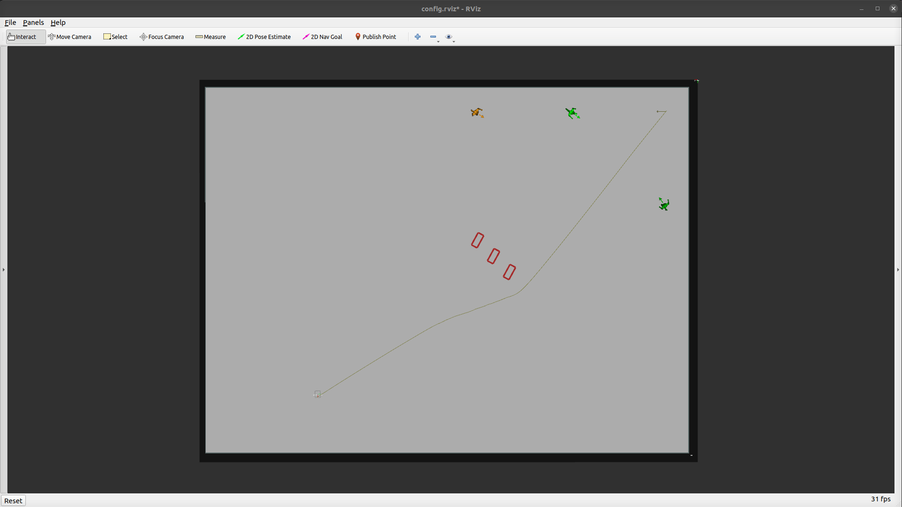

### Scenario

The scenario task will spawn the static and dynamic obstacles defined in the scenario file. Scenario files are world-dependent and are located in `arena_simulation_setup/worlds/<world>/scenarios/`

A scenario consists of 
```json
{
  "obstacles": {
    "dynamic": ["<PEDSIM AGENT DESCRIPTION>"],
    "static": [
      {
        "name": "<object name>",
        "pos": ["X", "Y", "theta"],
        "model": "<model name>"
      }
    ]
  },
  "robots": [
    {
      "start": ["X", "Y", "theta"],
      "goal": ["X", "Y", "theta"]
    }
  ]
}
```

To use the scenario file set the parameter `task_mode/scenario/scenario_file` in `arena_bringup/configs/task_generator.yaml` and then enter in the terminal:

```sh
roslaunch arena_bringup start_arena.launch model:=jackal tm_robots:=scenario tm_obstacles:=scenario
```

If the robot reached its goal defined in the scenario file the map will be resetted. 

This is the Scenario task mode with the scenario file `default.json`:

 