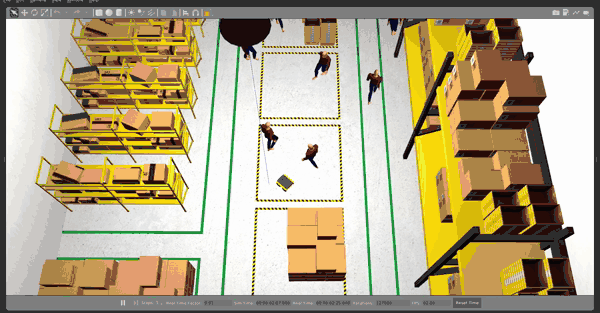
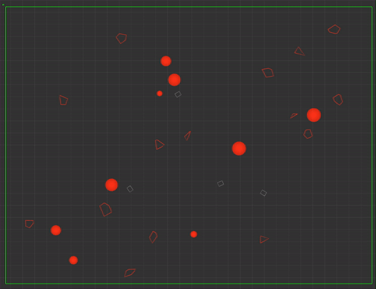
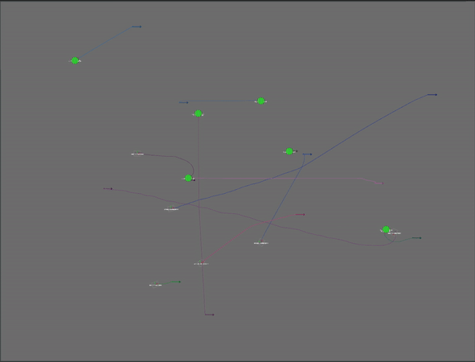

# Arena Rosnav (Arena 5.0, RSS '25) 

[Arena](https://github.com/Arena-Rosnav) is a platform for developing and benchmarking navigation algorithms in human-centric social environments. We offer a wide variety of different social force models, robots, planners, and world generation algorithms, and many more to use. All functions are abstracted and can be run across three widely used simulators: Flatland 2D, Gazebo, Unity 3D, and Isaac Sim (added 2025). Arena Rosnav also offers a complete evaluation pipeline for benchmarking the performance of robots and planners based on standard metrics, and a trainings pipeline for navigational models based on DRL and PPO. With this pipeline our own DRL planner [ROSNavRL](https://github.com/Arena-Rosnav/rosnav-rl) was created.

### Documentation
Follow the documentation for details how to use the platform: 

[Documentation](https://arena-rosnav.readthedocs.io/en/latest/)

### Arena-Education
We also offer worksheets which contain tasks and solutions and are a great starting point for beginners aiming to learn about robotics and the Arena platform:

[https://edu.arena-rosnav.org/](https://edu.arena-rosnav.org/) \
[Worksheet #1: Installation and First Steps](https://edu.arena-rosnav.org/)

<!-- |          Warehouse environment in Gazebo           |          Hospital environment in Gazebo          |
| :------------------------------------------------: | :----------------------------------------------: |
|  |  |

 

|                Simulation in Flatland                 |         Multiple agents in one simulation          |
| :---------------------------------------------------: | :------------------------------------------------: |
|  |  | -->

#### Isaac Sim

|  |  | 
| :--------------------------------------------------------------: | :---------------------------------------------------------------------: | 

|  |  | 
| :--------------------------------------------------------------: | :---------------------------------------------------------------------: |

#### Unity

|  |  | 
| :--------------------------------------------------------------: | :---------------------------------------------------------------------: | 

|  |  | 
| :--------------------------------------------------------------: | :---------------------------------------------------------------------: |

#### Gazebo

|  |  | 
| :--------------------------------------------------------------: | :---------------------------------------------------------------------: | 

|  |  | 
| :--------------------------------------------------------------: | :---------------------------------------------------------------------: |

#### Flatland

|  |  | 
| :--------------------------------------------------------------: | :---------------------------------------------------------------------: | 

|  |  | 
| :--------------------------------------------------------------: | :---------------------------------------------------------------------: |

### Features

- Automatic installation script for the arena rosnav environment 
- 4 different simulators including [Isaac](#isaac), [Unity](#unity), [Gazebo](#gazebo) and [Flatland](#flatland)
- We offer prebuilt, realistic simulation [environments](#supported-worlds), including offices, hospitals, canteens, warehouses, and much more
- Dynamic Map Generation including dynamic mazes
- Variety of Task Modes for robots and pedestrians

  | Task Mode | Short Description | Robots | Obstacles |
  | --- | --- | --- | --- |
  | `scenario` | load scenario file | ✓ | ✓ |
  | `random` | generate random positions | ✓ | ✓ |
  | `parametrized` | more fine-tuned random | | ✓ |
  | `guided` | waypoint sequence | ✓ | |
  | `explore` | explore map | ✓ | |

- Variety of [Robots](#supported-robots) including the go1 quadruped robot
- Variety of [Planners](#supported-planners) including our own DRL planner `ROSNavRL`
- Variety of social force models for pedestrians 
- Pipeline for evaluating approaches and analysing them based on standard metrics with our `Arena Evaluation` package.
- Pipeline to train planner agents based on reinforcement learning approaches from `stable baselines3`
- Modular and flexible structure for extension of new functionalities and approaches
- Fully integrated `Move Base Flex` in our Arena-Rosnav ecosystem

<!-- - Integration of [Flatland](https://flatland-simulator.readthedocs.io/en/latest/) to train new agents and [Flatland](https://flatland-simulator.readthedocs.io/en/latest/) and [Gazebo](https://classic.gazebosim.org/) for evaluating existing approaches.
- Variety of planners, robots and worlds
- Pipeline to train planner agents based on reinforcement learning approaches from [stable baselines3](https://github.com/DLR-RM/stable-baselines3.git)
- [Task generator](packages/task_generator.md) for managing highly dynamic and custom environments
- Our own DRL planner [ROSNavRL](packages/rosnavrl.md)
- Pipeline for evaluating approaches and analysing them based on standard metrics with our [Arena Evaluation](packages/arena_evaluation.md) package.
- Modular structure for extension of new functionalities and approaches
- Evaluation of multiple robots and planners in the same simulation
- Dynamic rviz config file creation for visualization -->

## Supported Planners

- [ROSNavRL](packages/rosnavrl.md): Our own planner based on neural networks.
- Dragon: from the [BARN challenge](https://github.com/Arena-Rosnav/dragon)
- Trail: from the [BARN challenge, TRAIL lab](https://github.com/TempleRAIL/nav-competition-icra2022-drl-vo)
- Applr: a hybrid approach by [Xuesu et al.](https://arxiv.org/abs/2105.07620)
- RLCA-ROS: a DRL-based colision avoidance approach from [Long et al.](https://github.com/Acmece/rl-collision-avoidance)
- CADRL: a DRL-based colision avoidance approach from [Everett et al.](https://github.com/mit-acl/cadrl_ros)
- SARL-Star 
- Crowdnav-ROS: a DRL-based colision avoidance approach from [Chen et al.](https://github.com/vita-epfl/CrowdNav)
- TEB: a classic approach by [Rösmann et al.](https://github.com/rst-tu-dortmund/teb_local_planner)
- DWA: the standard ROS local planning approach by [Marder-Eppstein et al.](http://wiki.ros.org/dwa_local_planner)
- MPC: a classic approach by [Rösmann et al.](https://github.com/rst-tu-dortmund/teb_local_planner)
- and many more (added with Arena 3.0 (2024), Arena 5.0 (2025))
## Supported Robots

|                       _turtlebot3-burger_                        |                       _jackal_                        |                        _ridgeback_                        |                       _agv-ota_                        |                       _tiago_                        |
| :--------------------------------------------------------------: | :---------------------------------------------------: | :-------------------------------------------------------: | :----------------------------------------------------: | :--------------------------------------------------: |
|  |  |  |  |  |

|                  _Robotino(rto)_                   |                       _youbot_                        |                        _turtlebot3_waffle_pi_                        |                 _Car-O-Bot4 (cob4)_                 |                       _dingo_                        |
| :------------------------------------------------: | :---------------------------------------------------: | :------------------------------------------------------------------: | :-------------------------------------------------: | :--------------------------------------------------: |
|  |  |  |  |  |

## Supported Worlds

#### Gazebo

|                       Hospital                       |                       Canteen                        |                        Campus                        |                       Factory                        |                       Warehouse                        |
| :--------------------------------------------------------------: | :---------------------------------------------------: | :-------------------------------------------------------: | :----------------------------------------------------: | :--------------------------------------------------: |
|  |  |  |  |  |

#### Unity

|                       Hospital                       |                       Restaurant                        |                        School                        |                       Japanese Garden                        |                       Warehouse                        |
| :--------------------------------------------------------------: | :---------------------------------------------------: | :-------------------------------------------------------: | :----------------------------------------------------: | :--------------------------------------------------: |
|  |  |  |  |  |

## Recent Publications
- [Arena 4.0 (ICRA2025)](https://arxiv.org/abs/2409.12471):  Improved World Generation and Realsim
- [Arena 3.0 (RSS2024)](https://roboticsproceedings.org/rss20/p074.html):  Social Navigation Platform
- [Arena-Web (RSS2023)](https://www.roboticsproceedings.org/rss19/p088.pdf):  Web-based Development and Benchmarking Platform for Autonomous Navigation Approaches
- [Arena-Rosnav 2.0 (IROS2023)](https://arxiv.org/abs/2302.10023): A Development and Benchmarking Platform for Robot Navigation in Highly Dynamic Environments
- [Arena-Bench (RA-L+ IROS22)](https://arxiv.org/abs/2206.05728): A Benchmarking Suite for Obstacle Avoidance Approaches in Highly Dynamic Environments
- [Arena-Rosnav (IROS21)](https://ieeexplore.ieee.org/document/9636226/authors#authors): Towards Deployment of Deep-Reinforcement-Learning-Based Obstacle Avoidance into Conventional Autonomous Navigation Systems
- [All-in-One (ICRA22)](https://ieeexplore.ieee.org/document/9811797): A DRL-based Control Switch Combining State-of-the-art Navigation Planners
