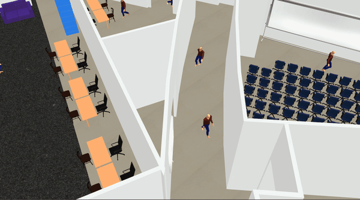

# Arena Rosnav

[Arena Rosnav](https://github.com/Arena-Rosnav/arena-rosnav) is a set of tools to train and evaluate navigational algorithms for obstacle avoidance. Arena Rosnav is modular and flexible and allows to easily integrate new environments and planners, as well as running existing planners and models in predefined benchmark scenarios and evaluating the performance with ease. Next to the planners and environments we offer a wide variety of different robots and worlds for your use.

Arena Rosnav offers a complete evaluation pipeline for benchmarking the performance of robots and planners based on standard metrics, and a trainings pipeline for navigational models based on DRL and PPO. With this pipeline our own DRL planner [ROSNavRL](https://github.com/Arena-Rosnav/rosnav-rl) was created.

> Please refer to the official documentation to find detailed instructions on how to install and use the _Arena Rosnav_ project. You can find the documentation by following [this](https://arena-rosnav.readthedocs.io/en/latest/) link.

<!-- |          Warehouse environment in Gazebo           |          Hospital environment in Gazebo          |
| :------------------------------------------------: | :----------------------------------------------: |
|  |  |

 

|                Simulation in Flatland                 |         Multiple agents in one simulation          |
| :---------------------------------------------------: | :------------------------------------------------: |
|  |  | -->

<h4 style="text-align: center;">Unity</h4>

|  |  | 
| :--------------------------------------------------------------: | :---------------------------------------------------------------------: | 

|  |  | 
| :--------------------------------------------------------------: | :---------------------------------------------------------------------: |

<h4 style="text-align: center;">Gazebo</h4>

|  |  | 
| :--------------------------------------------------------------: | :---------------------------------------------------------------------: | 

|  |  | 
| :--------------------------------------------------------------: | :---------------------------------------------------------------------: |

<h4 style="text-align: center;">Flatland</h4>

|  |  | 
| :--------------------------------------------------------------: | :---------------------------------------------------------------------: | 

|  |  | 
| :--------------------------------------------------------------: | :---------------------------------------------------------------------: |

### Features

- Integration of [Flatland](https://flatland-simulator.readthedocs.io/en/latest/) to train new agents and [Flatland](https://flatland-simulator.readthedocs.io/en/latest/) and [Gazebo](https://classic.gazebosim.org/) for evaluating existing approaches.
- Variety of planners, robots and worlds
- Pipeline to train planner agents based on reinforcement learning approaches from [stable baselines3](https://github.com/DLR-RM/stable-baselines3.git)
- [Task generator](packages/task_generator.md) for managing highly dynamic and custom environments
- Our own DRL planner [ROSNavRL](packages/rosnavrl.md)
- Pipeline for evaluating approaches and analysing them based on standard metrics with our [Arena Evaluation](packages/arena_evaluation.md) package.
- Modular structure for extension of new functionalities and approaches
- Evaluation of multiple robots and planners in the same simulation
- Dynamic rviz config file creation for visualization

## Supported Planners

- [ROSNavRL](packages/rosnavrl.md): Our own planner based on neural networks.
- Dragon: from the [BARN challenge](https://github.com/Arena-Rosnav/dragon)
- Trail: from the [BARN challenge, TRAIL lab](https://github.com/TempleRAIL/nav-competition-icra2022-drl-vo)
- Applr: a hybrid approach by [Xuesu et al.](https://arxiv.org/abs/2105.07620)
- RLCA-ROS: a DRL-based colision avoidance approach from [Long et al.](https://github.com/Acmece/rl-collision-avoidance)
- CADRL: a DRL-based colision avoidance approach from [Everett et al.](https://github.com/mit-acl/cadrl_ros)
- SARL-Star 
- Crowdnav-ROS: a DRL-based colision avoidance approach from [Chen et al.](https://github.com/vita-epfl/CrowdNav)
- TEB: a classic approach by [Rösmann et al.](https://github.com/rst-tu-dortmund/teb_local_planner)
- DWA: the standard ROS local planning approach by [Marder-Eppstein et al.](http://wiki.ros.org/dwa_local_planner)
- MPC: a classic approach by [Rösmann et al.](https://github.com/rst-tu-dortmund/teb_local_planner)

## Supported Robots

|                       _turtlebot3-burger_                        |                       _jackal_                        |                        _ridgeback_                        |                       _agv-ota_                        |                       _tiago_                        |
| :--------------------------------------------------------------: | :---------------------------------------------------: | :-------------------------------------------------------: | :----------------------------------------------------: | :--------------------------------------------------: |
|  |  |  |  |  |

|                  _Robotino(rto)_                   |                       _youbot_                        |                        _turtlebot3_waffle_pi_                        |                 _Car-O-Bot4 (cob4)_                 |                       _dingo_                        |
| :------------------------------------------------: | :---------------------------------------------------: | :------------------------------------------------------------------: | :-------------------------------------------------: | :--------------------------------------------------: |
|  |  |  |  |  |

## Recent Publications

- [Arena-Bench (RA-L+ IROS22)](https://arxiv.org/abs/2206.05728): A Benchmarking Suite for Obstacle Avoidance Approaches in Highly Dynamic Environments
- [Arena-Rosnav (IROS21)](https://ieeexplore.ieee.org/document/9636226/authors#authors): Towards Deployment of Deep-Reinforcement-Learning-Based Obstacle Avoidance into Conventional Autonomous Navigation Systems
- [All-in-One (ICRA22)](https://ieeexplore.ieee.org/document/9811797): A DRL-based Control Switch Combining State-of-the-art Navigation Planners
